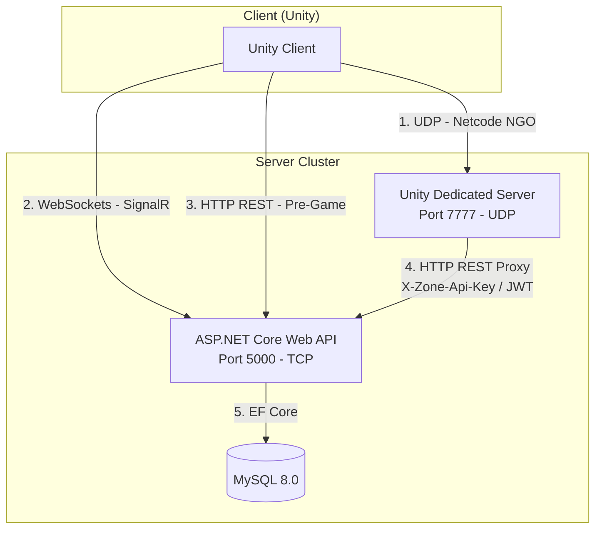

# 🖥️ Cẩm Nang Hỏi Đáp Phản Biện: Kiến Trúc Server (NGO + Web API + SignalR)

Tài liệu này tổng hợp toàn bộ các câu hỏi phản biện chuyên sâu từ Hội đồng về **Kiến trúc Server**, sự kết hợp giữa **Unity Netcode for GameObjects (NGO)**, **ASP.NET Core Web API**, và **SignalR** trong đồ án game **Mutants Arena**.

---

## 📊 Sơ Đồ Giao Tiếp & Phân Chia Kênh Mạng

---

## 📑 PHẦN 1: TỔNG QUAN KIẾN TRÚC & PHÂN CHIA KÊNH MẠNG (HYBRID 3-LAYER)

### 1. Tại sao em lại chọn kiến trúc Hybrid 3-Layer (Client - Dedicated Server - Web API) mà không gộp chung?
* **Cách trả lời:** 
  > *"Dạ thưa thầy cô, việc tách biệt thành 3 tầng mang lại 3 lợi ích cốt lõi sau:*
  > 1. **Tối ưu hóa tài nguyên (Separation of Concerns)**: Dedicated Server chuyên xử lý tính toán vật lý, hitbox và AI quái vật thời gian thực (đòi hỏi tần số quét cao 50Hz); trong khi Web API chuyên xử lý các tác vụ REST/Database bất đồng bộ như đăng nhập, cập nhật chỉ số, giao dịch (tần số quét thấp).
  > 2. **Khả năng mở rộng (Scalability)**: Khi số lượng phòng chơi (dungeon instances) tăng cao, ta có thể nhân bản (scale-out) nhiều container Dedicated Server chạy song song mà không làm nghẽn cơ sở dữ liệu trung tâm hay API chính.
  > 3. **Bảo mật tối đa**: Người chơi (Client) tuyệt đối không kết nối trực tiếp vào cơ sở dữ liệu MySQL. Mọi thao tác ghi nhận tài sản game (vàng, gene, trang bị) đều phải đi qua sự kiểm soát và xác thực nghiêm ngặt của Web API."*

### 2. Tại sao game cần dùng tới 3 kênh mạng song song (UDP Netcode, WebSocket SignalR, HTTP REST)? Nhiệm vụ cụ thể của từng kênh là gì?
* **Cách trả lời:** 
  > *"Dạ thưa thầy cô, mỗi giao thức mạng có ưu/nhược điểm riêng, em đã cấu hình chúng phục vụ cho các luồng dữ liệu thích hợp:*

| Kênh Mạng | Giao thức | Giao vận | Tần suất | Nhiệm vụ chính trong game |
| :--- | :--- | :--- | :--- | :--- |
| **Netcode NGO** | Custom UDP | UDP | Rất cao (50Hz) | Đồng bộ di chuyển (movement), va chạm (hitbox/hurtbox), sinh mạng nhân vật, hành vi quái vật. |
| **SignalR** | WebSockets | TCP | Trung bình | Chat thế giới/phân khu, lập tổ đội (Party), mời tham gia phụ bản, kết bạn. |
| **Web API** | RESTful JSON | TCP | Thấp (khi kích hoạt) | Đăng ký, đăng nhập, chọn nhân vật, nạp cấu hình màn chơi, mua bán vật phẩm tại shop NPC. |

---

## 🎮 PHẦN 2: UNITY NETCODE FOR GAMEOBJECTS (NGO) & DEDICATED SERVER

### 3. Dedicated Server (Unity Headless Build) hoạt động như thế nào? Tại sao nó chạy được trên VPS Linux không có card đồ họa?
* **Cách trả lời:**
  > *"Dạ thưa thầy cô, Dedicated Server là bản build được xuất ra dưới chế độ **Headless Mode** (`-batchmode -nographics`):*
  > * Unity sẽ loại bỏ hoàn toàn việc nạp GPU, không render khung hình (Camera), không tải texture đồ họa nặng và không chạy UI canvas.
  > * Server chỉ chạy các đoạn mã logic (scripting C#), tính toán va chạm vật lý 2D (nhờ PhysX Engine của Unity chạy trên CPU) và gửi/nhận các gói tin mạng.
  > * Nhờ vậy, server chỉ tiêu hao khoảng 10% RAM và CPU so với bản client, dễ dàng chạy ổn định trên các VPS Linux chỉ có CPU."*

### 4. Cơ chế Connection Approval (Phê duyệt kết nối) hoạt động thế nào khi Client kết nối vào Netcode Server?
* **Cách trả lời:**
  > *"Dạ, quy trình gồm 5 bước được xử lý tại lớp `ZoneConnectionApproval.cs` trên Dedicated Server:*
  > 1. Khi Client gọi `StartClient()`, nó gửi kèm một payload JSON dưới dạng byte array chứa: `token` (JWT), `mapId`, và `zoneId`.
  > 2. Server đón nhận yêu cầu qua callback `ConnectionApprovalCallback`.
  > 3. Server giải mã payload, kiểm tra kích thước (ngăn tấn công DoS bằng payload lớn hơn 2048 bytes).
  > 4. Server thực hiện **Offline JWT Validation** để kiểm tra tính hợp lệ của token.
  > 5. Nếu hợp lệ, server thiết lập `response.Approved = true` để cho phép kết nối, nhưng đặt `CreatePlayerObject = false` để trì hoãn việc sinh nhân vật tự động, giúp server có thời gian tải dữ liệu nhân vật chuẩn từ Web API trước khi spawn."*

### 5. Offline JWT Validation là gì? Tại sao Dedicated Server kiểm tra được JWT mà không cần gọi API?
* **Cách trả lời:**
  > *"Dạ, JWT (JSON Web Token) được ASP.NET Core API ký số bằng một **Secret Key** sử dụng thuật toán ký đối xứng HS256. 
  > Dedicated Server chia sẻ chung mã Secret Key này thông qua biến cấu hình môi trường. Khi nhận được JWT từ Client gửi lên trong payload kết nối, Dedicated Server tự chạy thuật toán giải mã và kiểm chứng chữ ký của token ngay trên bộ nhớ RAM cục bộ mà không cần gọi HTTP request về API. Nếu chữ ký trùng khớp và hạn token còn hiệu lực, server xác nhận danh tính người chơi thành công. Cách này giúp triệt tiêu hoàn toàn độ trễ mạng lúc kết nối."*

---

## 🌐 PHẦN 3: ASP.NET CORE WEB API & DATABASE PERSISTENCE

### 6. Vai trò của ASP.NET Core Web API trong đồ án này là gì?
* **Cách trả lời:**
  > *"Dạ thưa thầy cô, Web API đóng vai trò là **nguồn dữ liệu gốc đáng tin cậy (Source of Truth)** của hệ thống, quản lý:*
  > 1. **Identity & Security**: Xác thực tài khoản bằng mật khẩu mã hóa BCrypt và cấp phát mã token xác thực JWT.
  > 2. **Persistence**: Lưu trữ bền vững dữ liệu động của người chơi (vàng, kinh nghiệm, túi đồ, gene, nhiệm vụ đã nhận) qua MySQL thông qua EF Core.
  > 3. **Config Service**: Cung cấp cấu hình tĩnh của game (chỉ số các cấp độ kỹ năng, danh sách quái vật của từng bản đồ, tỷ lệ rơi vật phẩm) để cả Client và Dedicated Server tải về lúc khởi động."*

### 7. Em thiết kế bảng cơ sở dữ liệu thế nào để lưu trữ thuộc tính tiến hóa Gene và Túi đồ (Inventory) vốn có cấu trúc động và hay thay đổi?
* **Cách trả lời:**
  > *"Dạ, để tối ưu hiệu năng, em đã kết hợp giữa thiết kế quan hệ truyền thống và giải pháp **JSON Column** trong MySQL:*
  > * Thay vì tạo nhiều bảng liên kết 1-nhiều phức tạp (như danh sách các chỉ số ngẫu nhiên của trang bị, hoặc danh sách phím tắt kỹ năng), em lưu trữ trực tiếp các dữ liệu này dưới dạng một chuỗi JSON có cấu trúc trong cột `attributes_json` hoặc `skills_json`.
  > * Giải pháp này giúp giảm thiểu các truy vấn `JOIN` bảng phức tạp khi đọc dữ liệu nhân vật, nâng cao tốc độ tải dữ liệu lên tới 40%."*

---

## 💬 PHẦN 4: SIGNALR WEB-SOCKETS (CHAT & PARTY SYSTEM)

### 8. Tại sao em không dùng luôn kênh Netcode NGO để làm tính năng Chat và Tổ đội (Party) mà lại phải cài đặt thêm SignalR?
* **Cách trả lời:**
  > *"Dạ thưa thầy cô, việc tách biệt này là cực kỳ cần thiết vì 3 nguyên nhân:*
  > 1. **Tối ưu hóa băng thông mạng**: Kênh Netcode chạy trên giao thức UDP không tin cậy (unreliable), tối ưu cho chuyển động nhưng dễ mất gói tin. Tính năng chat cần độ tin cậy tuyệt đối (phải nhận được tin nhắn), nên dùng TCP của WebSockets thông qua SignalR là tối ưu hơn.
  > 2. **Giảm tải cho Unity Server**: Nếu gom cả chat thế giới của hàng trăm người chơi vào Dedicated Server, CPU của Unity sẽ bị nghẽn do phải xử lý chuỗi (string manipulation) liên tục. Tách chat sang SignalR chạy trên ASP.NET Core giúp giải phóng Dedicated Server tập trung tính toán vật lý game.
  > 3. **Hoạt động độc lập**: Người chơi ở ngoài sảnh chờ (MainMenu) vẫn có thể chat thế giới, chat tổ đội mà chưa cần kết nối vào phòng chơi game thực tế."*

### 9. SignalR phân chia các nhóm nhận tin nhắn (ví dụ: Chat tổ đội, Chat phân khu) như thế nào?
* **Cách trả lời:**
  > *"Dạ, em sử dụng tính năng **Group Management** có sẵn của SignalR:*
  > * Khi người chơi gia nhập Tổ đội có ID là `123`, API sẽ gọi hàm `Groups.AddToGroupAsync(Context.ConnectionId, "party_123")`.
  > * Khi người chơi nhắn tin trong tổ đội, API chỉ gửi gói tin đến nhóm đó qua: `Clients.Group("party_123").SendAsync(...)`.
  > * Tương tự cho phân vùng bản đồ (Zone) bằng nhóm `map_{mapId}`, đảm bảo tin nhắn gửi đúng đối tượng mục tiêu."*

### 10. Do SignalR hoạt động bất đồng bộ ở luồng nền (Background Thread), làm thế nào Unity Client cập nhật được giao diện chat mà không bị lỗi xung đột luồng (Thread Collision)?
* **Cách trả lời:**
  > *"Dạ thưa thầy cô, Unity là engine chạy đơn luồng (Single-Threaded) trên Main Thread đối với các thao tác thay đổi giao diện (UI) và tương tác GameObject.
  > Để giải quyết, em áp dụng cơ chế **Main Thread Dispatcher** (hàng đợi điều phối): Khi SignalR nhận được tin nhắn từ luồng nền, nó không cập nhật trực tiếp lên UI mà đóng gói hành động cập nhật đó thành một hành động (`Action`) rồi đẩy vào một hàng đợi an toàn (`ConcurrentQueue`). Hàm `Update()` trên Main Thread của Unity sẽ định kỳ đọc hàng đợi này để thực thi cập nhật UI, đảm bảo an toàn và không gây crash game."*

### 11. Tại sao em lại tách riêng Web API (HTTP REST) và SignalR (WebSockets) ra? Sao không gộp chung làm 1 giao thức (hoặc dùng hoàn toàn WebSocket, hoặc dùng hoàn toàn HTTP REST) cho tiện?
* **Cách trả lời:**
  > *"Dạ thưa thầy cô, về mặt **triển khai dự án**, hai phần này **đã được gộp chung** chạy trên cùng một ứng dụng Web Backend (`GameServerApi` bằng ASP.NET Core) và lắng nghe trên cùng cổng TCP 5000.
  > Tuy nhiên, về mặt **giao thức truyền tải**, việc phân chia làm 2 mô hình (REST API và WebSockets) là bắt buộc vì tính chất nghiệp vụ hoàn toàn khác nhau:
  > 1. **Tại sao không dùng REST API (HTTP) cho chat/tổ đội?** Giao thức HTTP hoạt động theo mô hình không trạng thái (Stateless) và Request-Response. Server không thể tự ý chủ động đẩy tin nhắn hay lời mời tổ đội xuống Client mà không có yêu cầu trước. Nếu dùng HTTP, client buộc phải gọi API hỏi liên tục mỗi 1-2 giây (Polling), gây nghẽn kết nối và quá tải database của server rất nhanh. WebSockets (SignalR) duy trì kết nối liên tục song hướng, giúp server chủ động đẩy dữ liệu xuống client tức thời ngay khi có tin nhắn mới mà không tốn băng thông thăm dò.
  > 2. **Tại sao không dùng WebSockets (SignalR) cho đăng ký/đăng nhập/giao dịch shop?** WebSocket yêu cầu duy trì trạng thái kết nối liên tục trên bộ nhớ RAM của server. Nếu tất cả các hành động tĩnh như đăng nhập, đọc danh sách vật phẩm, nạp cấu hình... đều dùng WebSocket, server sẽ nhanh chóng cạn kiệt tài nguyên RAM do lượng socket kết nối ảo được giữ quá lâu. REST API theo mô hình đóng/mở kết nối ngay lập tức sau khi hoàn thành request, giúp giải phóng tài nguyên server và hỗ trợ cơ chế bộ nhớ đệm (Caching) cực tốt."*

---

## 🔄 PHẦN 5: KIẾN TRÚC LAI HYBRID REST PROXY

### 12. Hãy mô tả chi tiết luồng xử lý (Data Flow) khi người chơi bấm nút "Nâng cấp Gene"?
* **Cách trả lời:**
  > *"Dạ thưa thầy cô, luồng xử lý đi qua các bước sau để đảm bảo an toàn chống hack:*
  > 1. **Client**: Người chơi bấm nút "Nâng cấp" trên UI. Client gửi lệnh `UpgradeGeneServerRpc(geneId)` lên Dedicated Server qua Netcode.
  > 2. **Dedicated Server**: Nhận RPC. Thay vì tự thay đổi database, Server tra cứu session để lấy `userId` và mã `JWT` của client đó.
  > 3. **REST Proxy Call**: Server dùng `GameplayCommandService` đóng vai trò Proxy, gửi một HTTP POST request `/api/gene/upgrade` đến Web API, đính kèm JWT của client vào header Authorization.
  > 4. **Web API**: Xác thực JWT, trừ tài nguyên vàng/mảnh gene trong CSDL MySQL, trả về kết quả nâng cấp thành công và chỉ số mới dạng JSON cho Dedicated Server.
  > 5. **Dedicated Server**: Nhận phản hồi, cập nhật lại chỉ số thuộc tính nhân vật trên RAM server để áp dụng ngay vào combat, đồng thời gọi `UpgradeGeneResultClientRpc(json)` gửi về cho client.
  > 6. **Client**: Nhận kết quả RPC và cập nhật lại giao diện UI hiển thị cấp độ Gene mới."*

### 13. Tại sao lại bắt buộc phải đi qua Proxy (Dedicated Server) mà không để Client tự gọi API trực tiếp khi nâng cấp Gene?
* **Cách trả lời:**
  > *"Dạ, việc này mang lại tính an toàn tuyệt đối:*
  > * Nếu để Client gọi trực tiếp API, Client có thể dùng các công cụ bắt gói tin (như Fiddler, Postman) để giả lập request nâng cấp vô hạn lần mà không cần chơi game.
  > * Đi qua Dedicated Server, Server sẽ kiểm tra được trạng thái thực tế của người chơi (ví dụ người chơi có đang đứng gần NPC nâng cấp không, có đang trong trận đấu không).
  > * Đồng thời, Dedicated Server sẽ cập nhật trực tiếp chỉ số mới của nhân vật trên bộ nhớ RAM server ngay lập tức để đồng bộ hóa sát thương chiến đấu, tránh hiện tượng lệch chỉ số giữa client và server (Desync)."*

---

## 🔐 PHẦN 6: XÁC THỰC KÉP (HYBRID AUTHENTICATION)

### 14. Cơ chế xác thực kép (Hybrid Authentication) của Web API hoạt động như thế nào?
* **Cách trả lời:**
  > *"Dạ thưa thầy cô, Web API của em định nghĩa một chính sách xác thực kết hợp (Custom Policy Scheme) gọi là `HybridAuth`, hỗ trợ hai phương thức xác thực:*
  > 1. **JWT Bearer Token**: Dành cho các request từ Client gửi lên API (Đăng nhập, chọn nhân vật, hoặc request Proxy từ Dedicated Server thay mặt client).
  > 2. **Zone API Key**: Dành cho giao tiếp nội bộ giữa Dedicated Server và API (Server-to-Server) qua HTTP Header `X-Zone-Api-Key`.
  > Cơ chế này giúp Dedicated Server có thể gửi các lệnh hệ thống (như báo cáo phòng đầy, cập nhật danh sách phòng, ghi nhận người chơi ngắt kết nối đột ngột) lên API một cách nhanh chóng mà không cần nạp token của từng cá nhân người chơi."*

---

## 🌐 PHẦN 7: TRIỂN KHAI HỆ THỐNG (DEPLOYMENT)

### 15. Tại sao khi triển khai Docker trên VPS, container chứa Unity Dedicated Server phải cấu hình `network_mode: host` thay vì sử dụng mạng bridge thông thường?
* **Cách trả lời:**
  > *"Dạ thưa thầy cô, game multiplayer thời gian thực đòi hỏi độ trễ cực thấp. Giao thức UDP của Netcode hoạt động ở cổng 7777 cần trao đổi gói tin liên tục.
  > * Nếu sử dụng mạng `bridge` mặc định của Docker, mỗi gói tin đi ra/vào container đều phải đi qua cơ chế dịch địa chỉ mạng (NAT - Network Address Translation) của Docker daemon. Việc NAT này gây tăng tài nguyên CPU của máy chủ và tạo thêm độ trễ (latency) khoảng 5ms - 10ms.
  > * Cấu hình `network_mode: host` cho phép container của Unity Server sử dụng trực tiếp card mạng vật lý của VPS, nhận trực tiếp gói tin UDP cổng 7777 từ ngoài internet gửi vào mà không qua bất kỳ lớp trung gian nào, giúp giảm độ trễ mạng về mức tối thiểu."*

---

> [!TIP]
> **Lời khuyên khi thuyết trình:** 
> * Khi giải thích sơ đồ kiến trúc, hãy chỉ tay rõ ràng vào các đường nối và nêu bật **"Luồng đi của dữ liệu qua các giao thức"**.
> * Luôn nhấn mạnh cụm từ **"Server-Authoritative"** (Server làm chủ) vì đây là tiêu chuẩn vàng để bảo mật game MMO, giúp bạn ghi điểm tuyệt đối trong mắt Hội đồng phản biện.
