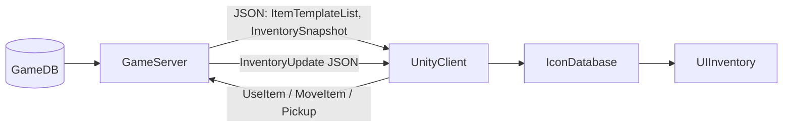

# Hướng Dẫn Setup UI Inventory Với Dữ Liệu Từ DB/Server (Runtime)

Tài liệu này mô tả cách thiết kế **UI túi đồ trong Unity** theo hướng:

- **DB/Server là nguồn dữ liệu gốc** cho item (`item_template`).
- Unity **không phải tạo lại item bằng tay** (ScriptableObject từng item).
- **Client nhận JSON từ server**, trong đó có `iconId` / `iconKey` để map sang Sprite icon trong Unity.
- UI sử dụng các script:
  - `NetworkInventory` / network layer của bạn.
  - `InventoryUI`
  - `InventorySlotUI`
  - `InventoryToggleButton`

---

## 1. Kiến Trúc Dữ Liệu – DB/Server Là Source Of Truth

### 1.1. Bảng `item_template` trong DB

Server và DB quản lý toàn bộ thông tin item, ví dụ bảng:

```sql
CREATE TABLE item_template (
    id INT PRIMARY KEY AUTO_INCREMENT,
    code VARCHAR(50) UNIQUE NOT NULL,       -- KIM_FRAGMENT, HP_POTION_SMALL, ...
    name VARCHAR(100) NOT NULL,
    description TEXT,

    category TINYINT NOT NULL,              -- 1=Equipment, 2=Consumable, 3=Material...
    item_type TINYINT NOT NULL,

    stackable BOOLEAN DEFAULT TRUE,
    max_stack INT DEFAULT 99,

    rarity TINYINT DEFAULT 1,

    icon_id VARCHAR(100) NOT NULL,          -- Khóa để Unity map sang Sprite (vd: HP_POTION_SMALL_ICON)

    base_stat_json JSON,
    created_at TIMESTAMP DEFAULT CURRENT_TIMESTAMP
);
```

- **`item_template` trong DB** là nơi bạn chỉnh sửa:
  - Tên, mô tả, stat, loại, stack, rarity, v.v.
  - **Không cần đụng đến Unity** khi muốn cân bằng game / sửa text (trừ khi thêm icon/model mới).
- Server khi khởi động:
  - `SELECT * FROM item_template` → load vào RAM.
  - Dùng `id`/`code`/`icon_id` để build data gửi cho client.

### 1.2. Snapshot túi đồ (inventory) trên server

Server giữ túi đồ player trong RAM (hoặc JSON trong DB như trong `INVENTORY_SYSTEM_GUIDE.md`), ví dụ struct:

```csharp
public class InventorySlotDto
{
    public int slotIndex;
    public int itemTemplateId;
    public string itemCode;
    public string iconId;
    public int quantity;
    public bool isEquipped;
}
```

Khi cần gửi cho Unity, server sẽ build JSON:

- Danh sách **item template** (để client có tên/desc nếu muốn hiển thị offline một phần).
- Snapshot **túi đồ** (list `InventorySlotDto`) cho từng player.

Client **chỉ đọc JSON từ server**, không truy cập DB trực tiếp.

---

## 2. Cấu Trúc JSON Gửi Cho Unity

### 2.1. ItemTemplateDto – thông tin master của item

Ví dụ gói JSON server gửi cho client khi login/mở game:

```json
{
  "itemTemplates": [
    {
      "id": 1,
      "code": "HP_POTION_SMALL",
      "name": "HP Potion (Small)",
      "description": "Hồi 50 HP.",
      "category": 2,
      "itemType": 1,
      "stackable": true,
      "maxStack": 99,
      "rarity": 1,
      "iconId": "hp_potion_small"
    },
    {
      "id": 2,
      "code": "SWORD_BRONZE",
      "name": "Bronze Sword",
      "description": "Thanh kiếm đồng cơ bản.",
      "category": 1,
      "itemType": 10,
      "stackable": false,
      "maxStack": 1,
      "rarity": 1,
      "iconId": "sword_bronze"
    }
  ]
}
```

Unity có thể parse thành struct:

```csharp
public class ItemTemplateDto
{
    public int id;
    public string code;
    public string name;
    public string description;
    public int category;
    public int itemType;
    public bool stackable;
    public int maxStack;
    public int rarity;
    public string iconId;   // Dùng để map ra Sprite
}
```

### 2.2. InventorySnapshot – dữ liệu túi đồ của player

Server gửi cho client snapshot túi đồ (dùng struct tương tự phía server):

```json
{
  "inventorySlots": [
    {
      "slotIndex": 0,
      "itemTemplateId": 1,
      "itemCode": "HP_POTION_SMALL",
      "iconId": "hp_potion_small",
      "quantity": 5,
      "isEquipped": false
    },
    {
      "slotIndex": 1,
      "itemTemplateId": 2,
      "itemCode": "SWORD_BRONZE",
      "iconId": "sword_bronze",
      "quantity": 1,
      "isEquipped": true
    }
  ]
}
```

Unity parse ra mảng `InventorySlotDto` và dùng để **đổ vào UI** (không cần ScriptableObject cho từng item).  
Các request như **UseItem/MoveItem/Pickup** gửi ngược về server, server cập nhật và gửi lại JSON update.

---

## 3. Cách Unity Map Icon Từ `iconId`

### 3.1. Tổ chức folder icon trong Unity

Bạn có thể:

- Dùng `Resources`:
  - Tạo thư mục: `Assets/Resources/ItemIcons`.
  - Mỗi Sprite đặt tên trùng với `iconId` trong DB (vd: `hp_potion_small.png`, `sword_bronze.png`).
- Hoặc dùng **Addressables**:
  - Đặt `Addressable Key` = `iconId` (vd: `"hp_potion_small"`).

Ý tưởng chính: **`iconId` trong DB/server = key để load Sprite trong Unity**.

### 3.2. IconDatabase / SpriteDatabase đơn giản

Để tránh phải `Resources.Load` lặp lại nhiều lần, bạn có thể tạo một `IconDatabase`:

```csharp
using System.Collections.Generic;
using UnityEngine;

public class IconDatabase : MonoBehaviour
{
    public static IconDatabase Instance { get; private set; }

    private readonly Dictionary<string, Sprite> _icons = new();

    [SerializeField] private string resourcesFolder = "ItemIcons";

    private void Awake()
    {
        if (Instance != null && Instance != this)
        {
            Destroy(gameObject);
            return;
        }

        Instance = this;
        DontDestroyOnLoad(gameObject);

        LoadAllIcons();
    }

    private void LoadAllIcons()
    {
        Sprite[] sprites = Resources.LoadAll<Sprite>(resourcesFolder);
        foreach (var sprite in sprites)
        {
            // Mặc định dùng tên sprite làm iconId
            _icons[sprite.name] = sprite;
        }
    }

    public Sprite GetIcon(string iconId)
    {
        _icons.TryGetValue(iconId, out var sprite);
        return sprite;
    }
}
```

- `iconId` từ server = `sprite.name` trong folder `Resources/ItemIcons`.
- Ở UI, bạn chỉ cần gọi: `IconDatabase.Instance.GetIcon(slot.iconId)` để gán icon.

> Nếu muốn đơn giản hơn nữa, bạn có thể bỏ `Dictionary` và dùng trực tiếp `Resources.Load<Sprite>($"ItemIcons/{iconId}")`, nhưng `IconDatabase` giúp cache và tránh load lại nhiều lần.

---

## 4. Setup UI Inventory (Panel, Slot, Button)

Phần này giữ ý tưởng UI cũ nhưng **dữ liệu đến từ JSON runtime** (InventorySnapshot), không phải ScriptableObject từng item.

### 4.1. Tạo UI Inventory (Canvas)

1. Tạo một `Canvas` (nếu chưa có).
2. Trong Canvas, tạo một `Panel`:
   - Đặt tên: `InventoryPanel`.
   - Đặt **Anchor / Position** theo ý (vd ở giữa màn hình).
3. Bên trong `InventoryPanel`:
   - Tạo `GameObject` (UI → Empty) tên: `SlotContainer`.
   - Thêm `Grid Layout Group`:
     - `Cell Size`, `Spacing`, `Constraint` theo ý (vd 5 cột x 4 hàng).

### 4.2. Tạo Prefab Slot UI (`InventorySlotUI`)

1. Trong Canvas, tạo một `Button` (hoặc `Image` + `Button`):
   - Đặt tên: `InventorySlot`.
2. Bên trong `InventorySlot`:
   - `Image` chính làm icon item (Image của Button).
   - Thêm `Text (TMP)` / `TextMeshProUGUI` để hiển thị **số lượng** (vd ở góc dưới):
     - Đặt tên: `QuantityText`.
   - (Optional) Thêm `Image`/`GameObject` để đánh dấu **đang equip**:
     - Đặt tên: `EquippedMark`.
3. Gắn script `InventorySlotUI` lên `InventorySlot`:
   - `Icon Image` → kéo `Image` chính vào.
   - `Quantity Text` → kéo `TMP_Text` số lượng vào.
   - `Equipped Mark` → kéo GameObject overlay vào (hoặc để trống nếu không dùng).
4. Kéo `InventorySlot` vào Project để tạo **Prefab** (vd: `Prefabs/UI/InventorySlot`).

Script `InventorySlotUI` sẽ có dạng:

- Nhận `InventorySlotDto` (hoặc data nội bộ) từ `InventoryUI`.
- Gọi `IconDatabase.Instance.GetIcon(slot.iconId)` để set icon.
- Hiển thị số lượng, trạng thái equip.
- `OnClick()` gửi request lên server (sử dụng `NetworkInventory.UseItem(slotIndex)` hoặc RPC riêng).

### 4.3. Gắn `InventoryUI` vào Panel

1. Chọn `InventoryPanel`.
2. Gắn script `InventoryUI` (đã có trong project).
3. Cấu hình trong Inspector:
   - **Inventory Root**:
     - Kéo chính `InventoryPanel` vào (hoặc để trống – script tự dùng `gameObject` hiện tại).
   - **Slot Container**:
     - Kéo `SlotContainer` (có `Grid Layout Group`) vào.
   - **Slot Prefab**:
     - Kéo prefab `InventorySlot` vào.
   - **Player Inventory / NetworkInventory**:
     - Kéo `NetworkInventory` của Player (hoặc script quản lý DTO inventory client) vào.
   - Bật/tắt **Auto Create Slots From Inventory** tùy bạn.

Khi nhận được `InventorySnapshot` từ server, client:

- Parse JSON thành `InventorySlotDto[]`.
- Gọi `InventoryUI.Refresh(slotsDto)` (hoặc thông qua `NetworkInventory.OnInventoryChanged`):
  - Lặp qua từng `slotIndex` → gọi `slotUI.SetSlot(dto)`.

### 4.4. Nút túi đồ (`InventoryToggleButton`)

Để player **bấm nút túi đồ** mở/đóng panel:

1. Trong Canvas, tạo một `Button`:
   - Đặt tên: `InventoryButton`.
   - Gán icon túi đồ (nếu có).
2. Gắn script `InventoryToggleButton` lên `InventoryButton`.
3. Trong `InventoryToggleButton`:
   - **Inventory UI**: kéo `InventoryPanel` (có `InventoryUI`) vào.

Khi player click:

- `InventoryToggleButton` gọi `InventoryUI.ToggleInventory()`.
- `InventoryPanel` **bật/tắt**.
- Khi bật, `InventoryUI` gọi `RefreshAllSlots()` để hiển thị toàn bộ item đang có (dựa trên data mới nhất từ server).

---

## 5. Luồng Hoạt Động Tổng Thể (Server ↔ Unity)

### 5.1. Sơ đồ luồng



### 5.2. Mô tả bằng lời

- **Khi server start**:
  - Load toàn bộ `item_template` từ DB vào RAM.
- **Khi player login**:
  - Server load túi đồ player (từ DB hoặc RAM).
  - Gửi cho client:
    - `ItemTemplateList` (tùy mức bạn cần hiển thị).
    - `InventorySnapshot` (list `InventorySlotDto` với `iconId`).
- **Client Unity**:
  - Cache `ItemTemplateDto[]` (nếu cần hiển thị tên/desc).
  - Cache `InventorySlotDto[]`.
  - Dùng `IconDatabase` để map `iconId` → Sprite và vẽ UI.
- **Khi nhặt item / dùng item / di chuyển slot**:
  - Client gửi request (RPC/API) lên server.
  - Server kiểm tra luật, update inventory trong RAM + DB.
  - Server gửi lại `InventoryUpdate` / snapshot mới.
  - Client cập nhật `InventorySlotDto[]` và gọi `InventoryUI.Refresh(...)`.

Nhờ vậy:

- Bạn chỉnh sửa item ở **DB/Server** (tên, mô tả, stat, iconId) → client nhận JSON mới → hiển thị mới.
- **Không cần nhập lại item ở Unity**, trừ khi thêm icon/model mới phải build asset thêm.

---

## 6. Setup InventoryNetworkBridge (Kết Nối Netcode với UI)

Nếu bạn đang dùng **Unity Netcode** và muốn UI tự động sync với `NetworkInventory`, bạn cần gắn script `InventoryNetworkBridge` để bridge giữa Netcode và UI DTO.

### 6.1. Tạo GameObject InventoryNetworkBridge

1. Trong scene game chính (scene có Canvas và Player), tạo một `GameObject`:
   - Đặt tên: `InventoryNetworkBridge`.
   - (Có thể gắn vào cùng GameObject với `InventoryUI` hoặc tách riêng).

2. Gắn script `InventoryNetworkBridge` vào GameObject này.

3. Trong Inspector của `InventoryNetworkBridge`:
   - **Network Inventory**:
     - Nếu player đã có trong scene: kéo `NetworkInventory` của Player vào.
     - Nếu player spawn runtime: để trống và bật `Auto Find Player Inventory` (mặc định đã bật).
   - **Inventory UI**:
     - Kéo `InventoryPanel` (có component `InventoryUI`) vào.
     - Hoặc để trống, script sẽ tự tìm `InventoryUI` trong scene.
   - **Auto Find Player Inventory**:
     - Bật nếu muốn script tự động tìm `NetworkInventory` của local player khi Start.

### 6.2. Cách Hoạt Động

Khi game chạy:

1. **Khi Start**:
   - `InventoryNetworkBridge` tự tìm `NetworkInventory` của local player (nếu `autoFindPlayerInventory = true`).
   - Tự tìm `InventoryUI` trong scene (nếu chưa gán).
   - Subscribe `NetworkInventory.OnInventoryChanged` để tự động refresh UI khi inventory thay đổi.

2. **Khi NetworkInventory thay đổi** (player nhặt item, dùng item, v.v.):
   - `NetworkInventory` phát event `OnInventoryChanged`.
   - `InventoryNetworkBridge.OnInventoryChanged()` được gọi.
   - Script đọc từng slot từ `NetworkInventory.GetSlot(i)`:
     - Nếu slot có item (`itemData != null && quantity > 0`):
       - Convert `InventorySlot` → `InventorySlotDto`:
         - `slotIndex = i`
         - `itemTemplateId = itemData.itemID`
         - `itemCode = itemData.itemName` (tạm thời, bạn có thể thêm field `code` vào `ItemData` sau)
         - `iconId = itemData.icon.name` (dùng tên sprite làm iconId)
         - `quantity = slot.quantity`
         - `isEquipped = false` (tạm thời)
     - Nếu slot trống:
       - Tạo `InventorySlotDto` với `quantity = 0`, các field khác = null/0.
   - Gọi `InventoryUI.SetInventoryData(slotDtos)` → UI tự refresh.

3. **Khi player mở túi đồ**:
   - Bấm nút → `InventoryToggleButton` gọi `InventoryUI.ToggleInventory()`.
   - Panel mở → `InventoryUI.RefreshAllSlots()` được gọi.
   - UI hiển thị toàn bộ item từ data đã cache (hoặc từ `NetworkInventory` nếu bạn muốn đọc lại).

### 6.3. Lưu Ý Quan Trọng

- **iconId mapping**:
  - Hiện tại `InventoryNetworkBridge` dùng `itemData.icon.name` làm `iconId`.
  - Đảm bảo tên sprite trong `ItemData.icon` **trùng với iconId trong DB/server**.
  - Ví dụ:
    - DB: `icon_id = "hp_potion_small"` → sprite trong Unity phải tên `hp_potion_small`.
    - Hoặc bạn có thể sửa `GetIconIdFromItemData()` để map theo quy ước riêng.

- **Nếu player spawn runtime**:
  - Khi player spawn, bạn có thể gọi:
    ```csharp
    InventoryNetworkBridge.Instance?.SetNetworkInventory(playerNetworkInventory);
    ```
  - Hoặc để `autoFindPlayerInventory = true`, script sẽ tự tìm khi Start (nhưng có thể bị delay nếu player spawn sau).

- **Nếu không có data inventory**:
  - `InventoryNetworkBridge` vẫn tạo `InventorySlotDto[]` với tất cả slot `quantity = 0`.
  - UI sẽ hiển thị các ô trống bình thường (không có icon, không có số lượng).

### 6.4. Test Setup

1. Bấm Play trong Unity.
2. Check Console:
   - `[InventoryNetworkBridge] Tìm thấy NetworkInventory của player: ...`
   - `[IconDatabase] Loaded X item icons from Resources/ItemIcons`
3. Thử nhặt item (hoặc spawn item vào inventory bằng code):
   - `NetworkInventory` sẽ phát event.
   - `InventoryNetworkBridge` sẽ convert và gửi cho `InventoryUI`.
   - UI sẽ tự refresh.
4. Bấm nút túi đồ:
   - Panel mở → thấy các ô item đã nhặt.

---

## 7. Checklist Theo Kiến Trúc Runtime

- **Database / Server**:
  - [ ] Thiết kế bảng `item_template` với cột `icon_id`.
  - [ ] Seed dữ liệu item (`code`, `name`, `description`, `icon_id`, stat...).
  - [ ] Khi start server: load `item_template` vào RAM.
  - [ ] Triển khai API/gói network:
    - [ ] `ItemTemplateList` (gửi 1 lần sau login hoặc khi cần).
    - [ ] `InventorySnapshot` (gửi khi login/mở túi).
    - [ ] `InventoryUpdate` (gửi khi túi đồ thay đổi).
  - [ ] Xử lý request: `PickupItem`, `UseItem`, `MoveItem`, `DropItem`…

- **Unity – Icon & Data Runtime**:
  - [ ] Tạo folder `Resources/ItemIcons` / Addressables group cho icon.
  - [ ] Đảm bảo tên sprite hoặc key = `iconId` trong DB.
  - [ ] Tạo `IconDatabase` (hoặc loader tương đương) để map `iconId` → Sprite.
  - [ ] Parse JSON `ItemTemplateDto[]` & `InventorySlotDto[]` từ server.

- **Unity – UI Inventory**:
  - [ ] Tạo `InventoryPanel` trong Canvas.
  - [ ] Tạo `SlotContainer` + `Grid Layout Group`.
  - [ ] Tạo prefab `InventorySlot` + gắn `InventorySlotUI`.
  - [ ] Gắn `InventoryUI` lên `InventoryPanel`, cấu hình `SlotContainer`, `SlotPrefab`, `Max Slot Count`.
  - [ ] **Nếu dùng Unity Netcode**: Tạo `InventoryNetworkBridge` để bridge giữa `NetworkInventory` và `InventoryUI`:
    - [ ] Gắn script `InventoryNetworkBridge` vào GameObject trong scene.
    - [ ] Kéo `NetworkInventory` của Player vào (hoặc bật `Auto Find Player Inventory`).
    - [ ] Kéo `InventoryPanel (InventoryUI)` vào.
    - [ ] Test: nhặt item → UI tự refresh.
  - [ ] **Nếu dùng server riêng (HTTP/WebSocket)**: Khi nhận `InventorySnapshot`/`InventoryUpdate`, parse JSON → `InventorySlotDto[]` → gọi `InventoryUI.SetInventoryData(...)`.

- **Unity – Nút Túi Đồ**:
  - [ ] Tạo `InventoryButton` trong Canvas.
  - [ ] Gắn `InventoryToggleButton` + kéo `InventoryPanel (InventoryUI)` vào.

Sau khi hoàn thành, **player bấm nút túi đồ** sẽ mở UI Inventory đọc dữ liệu từ **server/DB (qua JSON)**, map `iconId` sang Sprite trong Unity, và hiển thị **toàn bộ item hiện có** mà không cần nhập tay item ở hai nơi. 