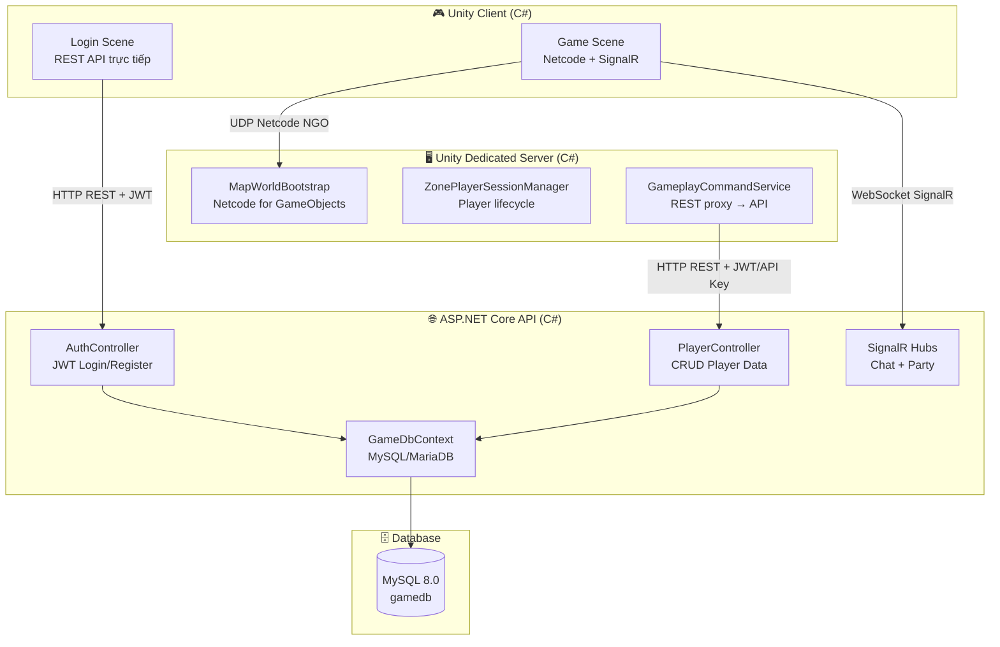
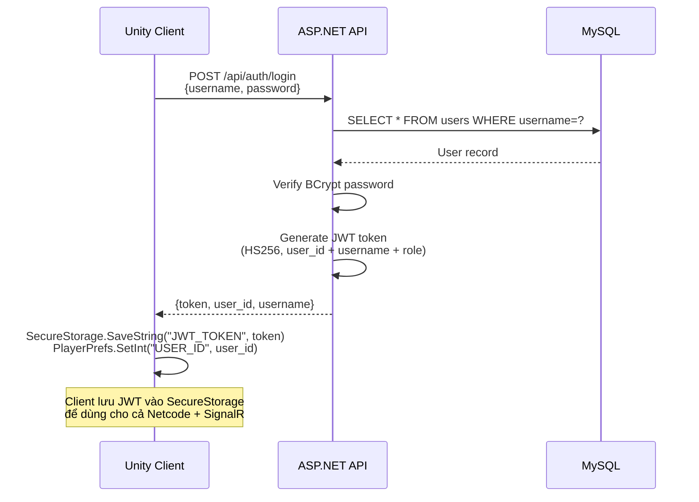
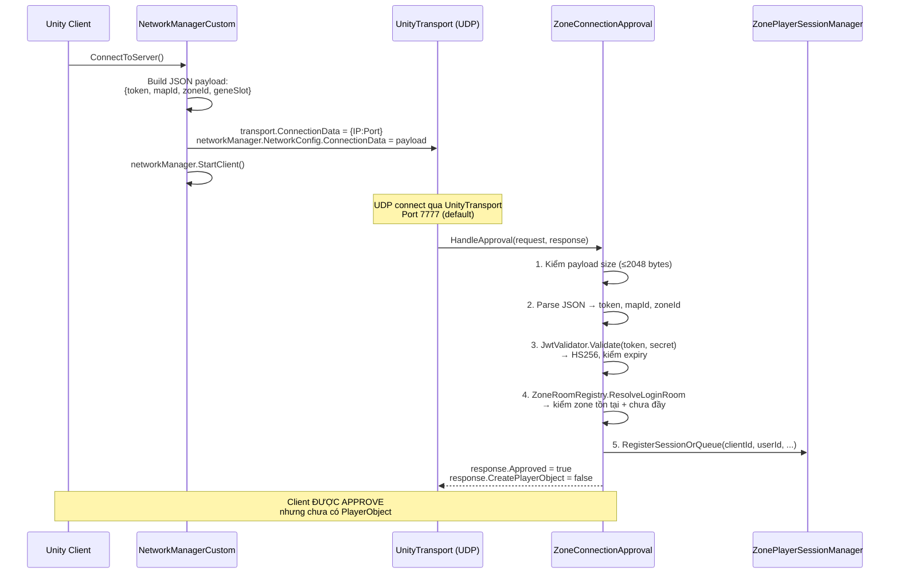
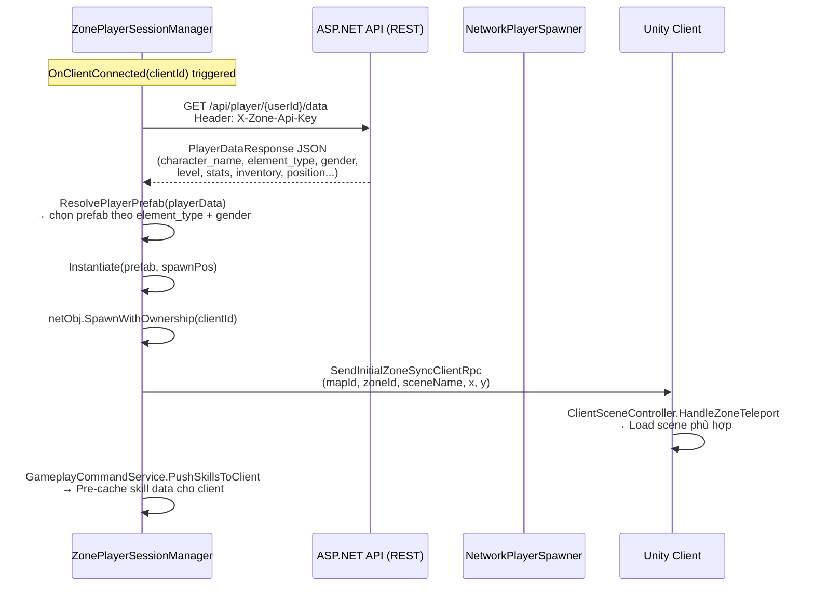
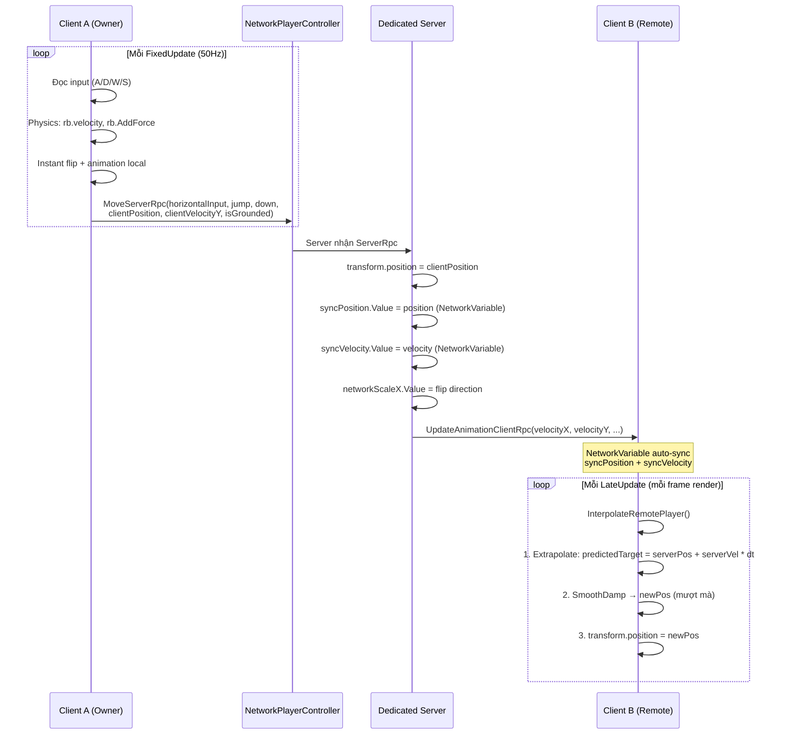
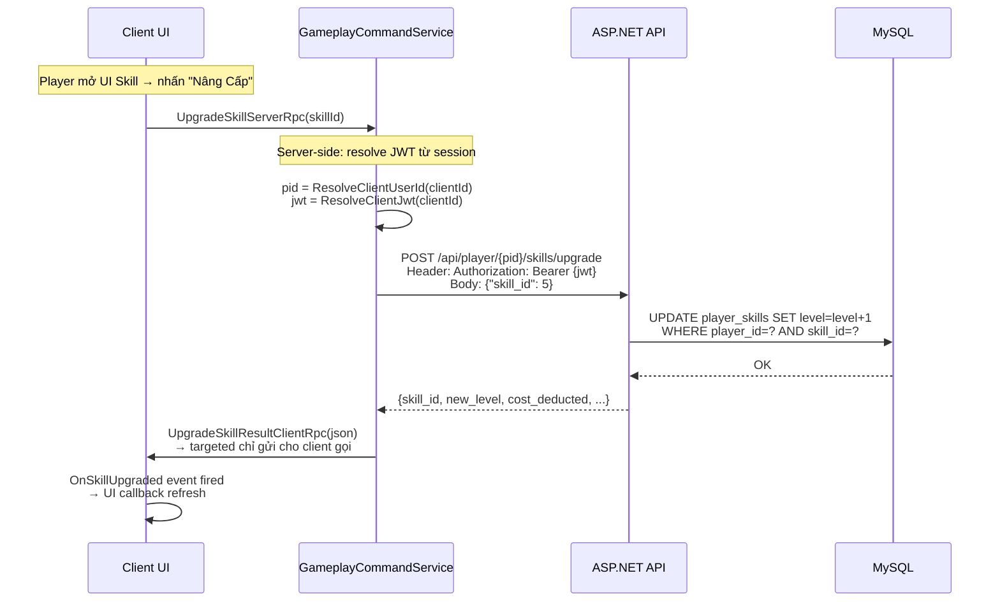
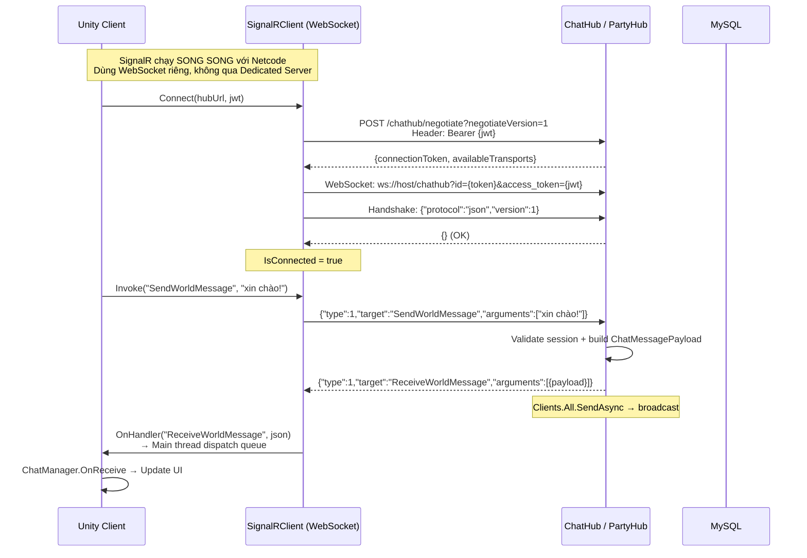
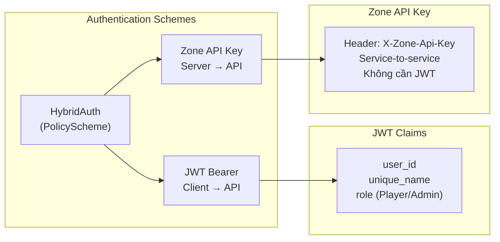
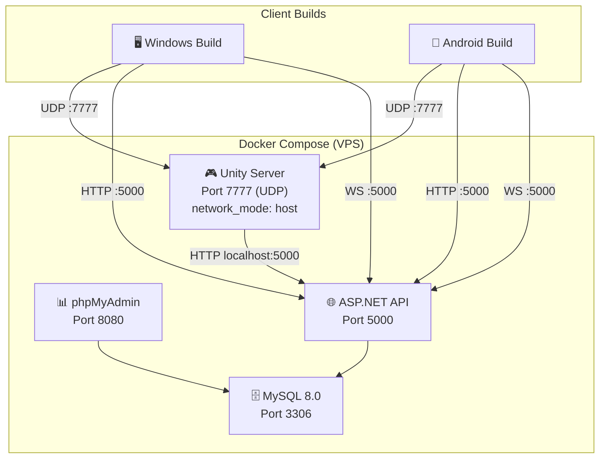

# 🏗️ Kiến Trúc Tổng Quan Dự Án — Mutants Arena

## 1. Tổng Quan Hệ Thống

Dự án game RPG 2D multiplayer online sử dụng kiến trúc **Hybrid 3-Layer** gồm 3 thành phần chính chạy độc lập:



### 📝 Giải thích Sơ đồ Kiến trúc Tổng thể:
Sơ đồ kiến trúc tổng quan thể hiện cấu trúc 3 tầng phân rã của hệ thống game MMORPG:
- **Tầng Client (Unity Client)**: Giao diện trực quan phía người dùng, bao gồm 2 cảnh (Scene) chính. Màn hình đăng nhập/đăng ký (`Login Scene`) giao tiếp trực tiếp với Backend API qua giao thức HTTPS REST. Khi chuyển sang màn hình chơi game (`Game Scene`), Client duy trì kết nối mạng thời gian thực qua hai kênh song song: UDP (qua Netcode for GameObjects) kết nối tới Dedicated Server phục vụ gameplay, và WebSockets (qua SignalR) kết nối trực tiếp tới Backend API phục vụ các hoạt động xã hội như chat và tổ đội.
- **Tầng Dedicated Server (Unity Dedicated Server)**: Là bản build headless (không đồ họa) của Unity chạy độc lập trên máy chủ. Thành phần này đóng vai trò máy chủ phân vùng (Zone Server), chịu trách nhiệm điều phối toàn bộ trạng thái game (vị trí nhân vật, spawn quái vật, cơ chế combat). Nó sử dụng `GameplayCommandService` như một REST Proxy để giao tiếp với Backend API bằng cơ chế bảo mật Zone API Key, đảm bảo toàn bộ dữ liệu người chơi được đồng bộ an toàn.
- **Tầng API & Database (ASP.NET Core Web API & MySQL)**: Là trung tâm quản lý nghiệp vụ và lưu trữ dữ liệu của hệ thống. ASP.NET Core API nhận yêu cầu từ Client và Dedicated Server, kiểm tra tính hợp lệ bằng cơ chế Hybrid Authentication (xác thực kép JWT và API Key). Dữ liệu sau đó được lưu trữ lâu dài trong cơ sở dữ liệu quan hệ MySQL thông qua Entity Framework Core (EF Core).

---

## 📦 Các Thành Phần Chính

### 1. Unity Client (`Client/`)
| Vai trò | Mô tả |
|---------|-------|
| **Giao diện người chơi** | Render game 2D, nhận input, hiển thị UI |
| **Transport** | Netcode for GameObjects (UDP qua UnityTransport) |
| **Chat/Party** | SignalR WebSocket (JSON Hub Protocol) |
| **Pre-game REST** | Gọi trực tiếp API để Login, Register, chọn nhân vật |

### 2. Unity Dedicated Server (`Client/` build Server)
| Vai trò | Mô tả |
|---------|-------|
| **Game Server** | Cùng codebase Unity, build Headless Linux (`-batchmode -nographics`) |
| **Authority** | Server-authoritative: xác thực, spawn, relay movement, combat |
| **REST Proxy** | Thay mặt client gọi API (dùng JWT của client hoặc Zone API Key) |

### 3. ASP.NET Core API (`GameServerApi/`)
| Vai trò | Mô tả |
|---------|-------|
| **Backend REST** | 17 Controllers xử lý tất cả game data CRUD |
| **SignalR Hubs** | ChatHub + PartyHub — real-time chat/party qua WebSocket |
| **Database** | Entity Framework Core → MySQL 8.0 |
| **Auth** | JWT Bearer + Zone API Key (HybridAuth) |

### 4. MySQL Database
| Vai trò | Mô tả |
|---------|-------|
| **Persistence** | Lưu user, player_data, inventory, quests, skills, gene, maps, enemies... |
| **Schema** | ~370KB SQL dump (`gamedb.sql`), auto-seed khi startup |

---

## 🔄 Luồng Giao Tiếp Chi Tiết

### Phase 1: Pre-Game (Login/Register) — REST Trực Tiếp



### 📝 Giải thích Chi tiết Luồng Đăng nhập (Phase 1):
Quy trình xác thực tài khoản (Authentication) được thực hiện trực tiếp giữa Unity Client và ASP.NET Core API:
- **Bước 1**: Người dùng nhập thông tin tài khoản tại giao diện đăng nhập trên Client. Client gửi yêu cầu đăng nhập bằng phương thức `POST` tới endpoint `/api/auth/login` kèm theo payload JSON chứa `username` và `password`.
- **Bước 2 & 3**: API nhận request, truy vấn cơ sở dữ liệu MySQL bằng EF Core để kiểm tra sự tồn tại của tài khoản. Cơ sở dữ liệu trả về bản ghi người dùng bao gồm chuỗi mật khẩu đã được mã hóa.
- **Bước 4**: API sử dụng thư viện bảo mật BCrypt để so sánh mật khẩu dạng plaintext do người dùng nhập với chuỗi hash lưu trong database. Phương pháp này đảm bảo mật khẩu được bảo vệ an toàn ngay cả khi database bị rò rỉ.
- **Bước 5**: Nếu mật khẩu khớp, API tiến hành tạo một JSON Web Token (JWT) sử dụng thuật toán ký HS256 (HMAC with SHA-256). Token này chứa các thông tin định danh (claims) như `user_id`, `username`, và vai trò của tài khoản (`role`).
- **Bước 6 & 7**: API phản hồi về Client kết quả đăng nhập thành công kèm JWT. Client nhận và mã hóa lưu trữ JWT bằng `SecureStorage` (cùng `user_id` lưu ở `PlayerPrefs`) để làm minh chứng xác thực cho mọi giao dịch mạng và kết nối WebSocket/UDP tiếp theo.

> [!IMPORTANT]
> **File liên quan:**
> - Client: [LoginController.cs](file:///c:/Hub/DoAn/Client/Assets/Scripts/UI/Auth/LoginController.cs) → [APIClient.cs](file:///c:/Hub/DoAn/Client/Assets/Scripts/Services/Api/APIClient.cs)
> - Server: [AuthController.cs](file:///c:/Hub/DoAn/GameServerApi/Controllers/AuthController.cs) → [AuthService.cs](file:///c:/Hub/DoAn/GameServerApi/Services/AuthService.cs)

---

### Phase 2: Kết Nối Netcode (Client → Dedicated Server)



### 📝 Giải thích Chi tiết Luồng Kết nối Netcode (Phase 2):
Quy trình phê duyệt kết nối (Connection Approval) là bước bảo mật quan trọng để ngăn chặn kết nối trái phép vào Dedicated Server:
- **Khởi tạo kết nối**: Khi người chơi chuyển từ sảnh chờ vào game, Client gọi phương thức `ConnectToServer()`. Script `NetworkManagerCustom` tiến hành đóng gói một payload JSON chứa mã JWT token, `mapId`, `zoneId`, và `geneSlot`. Payload này được gán vào `ConnectionData` của `NetworkManager`.
- **Gửi request mạng**: Client bắt đầu thiết lập kết nối UDP qua `UnityTransport` (mặc định ở cổng 7777).
- **Xử lý tại máy chủ (Dedicated Server)**: Khi nhận được yêu cầu kết nối, server kích hoạt callback `HandleApproval` trên lớp `ZoneConnectionApproval`.
- **Quy trình 5 bước xác thực nghiêm ngặt**:
  1. **Kiểm tra kích thước (Size Check)**: Server kiểm tra kích thước payload gửi lên để đảm bảo nó nhỏ hơn hoặc bằng 2048 bytes, hạn chế các cuộc tấn công từ chối dịch vụ (DoS) bằng payload rác khổng lồ.
  2. **Phân tích dữ liệu (Parsing)**: Giải mã mảng byte thành chuỗi JSON và trích xuất các tham số `token`, `mapId`, và `zoneId`.
  3. **Xác thực mã JWT (JWT Offline Validation)**: Server sử dụng thư viện tự viết `JwtValidator` để giải mã và kiểm tra chữ ký của JWT token bằng thuật toán HS256 với secret key dùng chung. Việc này diễn ra hoàn toàn *offline* ngay trên server mà không cần gọi API ngược lại backend, giúp giảm thiểu độ trễ tối đa.
  4. **Kiểm tra phòng và bản đồ (Room Resolution)**: Kiểm tra xem phân vùng (Zone ID) và bản đồ (Map ID) mà client muốn vào có hợp lệ không, đồng thời đảm bảo số lượng người chơi trong phân vùng chưa đạt giới hạn tối đa.
  5. **Đăng ký phiên chơi (Session Registration)**: Ghi nhận ánh xạ giữa `clientId` của Netcode và `userId` của tài khoản thông qua `ZonePlayerSessionManager`.
- **Hoàn tất phê duyệt**: Server thiết lập `response.Approved = true` để chấp nhận kết nối, đồng thời đặt `CreatePlayerObject = false`. Việc trì hoãn tạo nhân vật tự động của Netcode nhằm đảm bảo server có thể tải đầy đủ thông tin nhân vật cụ thể từ cơ sở dữ liệu trước khi thực hiện quá trình khởi tạo (instantiation).

> [!NOTE]
> **Connection Approval Payload Format:**
> ```json
> {"token":"eyJhbG...","mapId":0,"zoneId":0,"geneSlot":1}
> ```
> JWT được validate offline trên server bằng [JwtValidator.cs](file:///c:/Hub/DoAn/Client/Assets/Scripts/Network/Shared/JwtValidator.cs) (HS256, không cần gọi API).

**File liên quan:**
- Client: [NetworkManagerCustom.cs](file:///c:/Hub/DoAn/Client/Assets/Scripts/Network/Managers/NetworkManagerCustom.cs)
- Server: [ZoneConnectionApproval.cs](file:///c:/Hub/DoAn/Client/Assets/Scripts/Network/Server/ZoneConnectionApproval.cs)

---

### Phase 3: Spawn Player (Server-Side)



### 📝 Giải thích Chi tiết Luồng Spawn Nhân Vật (Phase 3):
Quy trình khởi tạo nhân vật phía máy chủ (Server-Side Player Spawning) sau khi kết nối Netcode thành công:
- **Sự kiện kết nối**: Khi kết nối được phê duyệt, sự kiện `OnClientConnected` được kích hoạt trên Dedicated Server thông qua `ZonePlayerSessionManager`.
- **Tải dữ liệu nhân vật**: Server thực hiện một HTTP GET request tới ASP.NET Core API tại endpoint `/api/player/{userId}/data`. Request này đính kèm tiêu đề xác thực `X-Zone-Api-Key`, cho phép Dedicated Server truy cập nhanh dữ liệu nhân vật mà không cần sử dụng JWT của người chơi. API truy vấn database và trả về thông tin nhân vật chi tiết (tên, hệ nguyên tố, cấp độ, chỉ số stats, trang bị hiện tại, vị trí cuối cùng lưu trên bản đồ).
- **Khởi tạo đối tượng mạng (Instantiation)**: Dựa trên hệ nguyên tố (`element_type` như Kim, Mộc, Thủy, Hỏa, Thổ, Phong) và giới tính của nhân vật, server tìm kiếm prefab tương ứng. Server gọi hàm `Instantiate` để tạo nhân vật tại vị trí spawn và kích hoạt `SpawnWithOwnership(clientId)` của Netcode, trao quyền sở hữu đối tượng này cho Client.
- **Đồng bộ hóa cảnh chơi (Scene Sync)**: Server phát lệnh `SendInitialZoneSyncClientRpc` chứa thông tin bản đồ và tọa độ. Client nhận lệnh này sẽ tải cảnh chơi tương ứng (Scene Load) và di chuyển nhân vật cục bộ đến đúng tọa độ.
- **Tối ưu hóa dữ liệu (Pre-cache)**: Server gọi `GameplayCommandService` để nạp trước (pre-cache) dữ liệu kỹ năng của người chơi từ API xuống Client, đảm bảo người chơi có thể tương tác với kỹ năng tức thì không bị trễ.

> [!TIP]
> Server dùng **Zone API Key** (không phải JWT) để gọi API lấy player data. Đây là service-to-service auth, nhanh hơn và không phụ thuộc JWT expiry.

**File liên quan:**
- [ZonePlayerSessionManager.cs](file:///c:/Hub/DoAn/Client/Assets/Scripts/Network/Server/ZonePlayerSessionManager.cs#L284-L428)
- [NetworkPlayerSpawner.cs](file:///c:/Hub/DoAn/Client/Assets/Scripts/Network/Player/NetworkPlayerSpawner.cs) (legacy fallback)

---

### Phase 4: In-Game Movement Sync (Real-time)



### 📝 Giải thích Chi tiết Luồng Đồng bộ Di chuyển (Phase 4):
Quy trình đồng bộ di chuyển thời gian thực sử dụng kiến trúc **Owner-Authoritative** kết hợp các kỹ thuật chống giật (Anti-jitter):
- **Xử lý tại Client sở hữu (Owner Client A)**: Mỗi chu kỳ vật lý `FixedUpdate` (50 lần/giây), Client A đọc dữ liệu đầu vào của người chơi, áp dụng lực vật lý lên Rigidbody2D của nhân vật để di chuyển cục bộ ngay lập tức và chạy hiệu ứng hoạt ảnh tại máy của mình nhằm tối ưu hóa trải nghiệm người dùng (không có độ trễ cảm giác). Cùng lúc đó, Client gửi gói tin `MoveServerRpc` lên server chứa vị trí thực tế, vận tốc, trạng thái chạm đất (`isGrounded`).
- **Xử lý tại Dedicated Server**: Server nhận RPC và cập nhật vị trí của đối tượng nhân vật trên server theo vị trí mà client gửi lên (Server tin tưởng client sở hữu về mặt di chuyển vì client giữ bản đồ vật lý đầy đủ). Server thay đổi giá trị các biến `NetworkVariable` gồm `syncPosition` (vị trí), `syncVelocity` (vận tốc) và hướng quay mặt (`networkScaleX`). Hệ thống Netcode sẽ tự động đồng bộ hóa các biến này xuống tất cả các client khác. Server cũng gửi ClientRpc để đồng bộ hóa hoạt ảnh.
- **Xử lý mượt mà tại Client quan sát (Remote Client B)**: Client B nhận dữ liệu vị trí và vận tốc từ Server. Để tránh hiện tượng giật giật (jitter) do độ trễ truyền gói tin mạng, Client B thực hiện đồng bộ hóa trong hàm `LateUpdate` (chạy theo tốc độ render frame thực tế) thông qua phương thức `InterpolateRemotePlayer()`:
  1. **Nội suy / Dự đoán vị trí (Extrapolation)**: Dự đoán vị trí đích tiếp theo (`predictedTarget`) của nhân vật dựa trên vận tốc hiện tại (`syncVelocity`) nhân với khoảng thời gian trôi qua (`deltaTime`), giúp nhân vật di chuyển liên tục không bị đứng khựng khi gói tin mạng tiếp theo chưa tới.
  2. **Làm mịn di chuyển (SmoothDamp)**: Sử dụng thuật toán `Vector2.SmoothDamp` để trượt nhân vật mượt mà từ vị trí hiện tại đến vị trí dự đoán, triệt tiêu hoàn toàn chuyển động giật lắc của nhân vật của người chơi khác.

> [!NOTE]
> **Kiến trúc Owner-Authoritative:**
> - **Owner client** chạy physics cục bộ (có ground collider) → gửi position thực tế lên server
> - **Server** KHÔNG simulate physics (ServerScene không có ground) → chỉ **relay** position
> - **Remote client** interpolate bằng `SmoothDamp` + velocity extrapolation

**File liên quan:**
- [NetworkPlayerController.cs](file:///c:/Hub/DoAn/Client/Assets/Scripts/Network/Player/NetworkPlayerController.cs)
- [PlayerMovement.cs](file:///c:/Hub/DoAn/Client/Assets/Scripts/Player/Controllers/PlayerMovement.cs)

---

### Phase 5: In-Game Actions (Hybrid REST Proxy)



### 📝 Giải thích Chi tiết Luồng Hành động Gameplay (Phase 5):
Quy trình xử lý các hành động in-game (như nâng cấp kỹ năng, mua bán, cường hóa trang bị) theo mô hình **Hybrid REST Proxy**:
- **Tương tác người dùng**: Người chơi thực hiện hành động trên giao diện UI, ví dụ nhấn nút "Nâng Cấp" một kỹ năng. Client gửi yêu cầu thông qua `UpgradeSkillServerRpc(skillId)` tới Dedicated Server.
- **Xử lý Proxy tại Dedicated Server**:
  - Thay vì Client trực tiếp gọi HTTP Web API (có nguy cơ bị hack, giả mạo dữ liệu hoặc lộ thông tin endpoint API), Dedicated Server đóng vai trò là một Proxy trung gian.
  - Server tra cứu thông tin phiên chơi (session) để lấy `userId` (`pid`) và mã JWT token đã được lưu trữ an toàn khi người chơi kết nối ban đầu.
  - Server thực hiện một HTTP POST request tới ASP.NET Core API, đính kèm JWT token của chính Client đó vào header `Authorization: Bearer`.
- **Xử lý tại Backend API & Database**: API nhận request từ Dedicated Server, xác thực JWT, chạy logic nghiệp vụ (kiểm tra điều kiện tiền tệ, cấp độ nhân vật), và cập nhật trực tiếp dữ liệu kỹ năng vào MySQL Database. Kết quả thành công hoặc thất bại được trả về cho Dedicated Server dưới dạng JSON.
- **Phản hồi Client**: Dedicated Server nhận kết quả từ API và chuyển tiếp thông tin này xuống đúng Client gửi yêu cầu ban đầu qua phương thức `UpgradeSkillResultClientRpc`. Client nhận phản hồi, kích hoạt Event hệ thống để cập nhật lại giao diện người dùng (UI Refresh).

> [!IMPORTANT]
> **Tại sao không để Client gọi API trực tiếp?**
> - **Chống hack**: Client không biết API URL lúc in-game, server kiểm soát mọi request
> - **JWT management**: Server lưu JWT của mỗi client, tự động gắn vào header
> - **Audit trail**: Mọi action đi qua server → log được

**GameplayCommandService hỗ trợ:**
| Action | ServerRpc → REST endpoint |
|--------|---------------------------|
| Player Data | `GET /api/player/{id}/data` |
| Skills | `GET/POST /api/player/{id}/skills` |
| Potential | `GET/POST /api/player/{id}/potential` |
| Equipment | `GET/POST /api/player/{id}/equipment` |
| Gene Upgrade | `GET/POST /api/gene/config, /upgrade` |
| Equipment Upgrade | `GET/POST /api/upgrade/*` |
| Inventory Use/Remove | `POST /api/player/{id}/inventory/*` |
| Dungeon List | `GET /api/dungeon/list` |
| Utility Shop | `GET/POST /api/npc/shop/*` |

**File liên quan:** [GameplayCommandService.cs](file:///c:/Hub/DoAn/Client/Assets/Scripts/Network/Server/GameplayCommandService.cs)

---

### Phase 6: SignalR — Chat & Party (Song Song Với Netcode)



### 📝 Giải thích Chi tiết Luồng Chat và Tổ Đội (Phase 6):
Quy trình giao tiếp mạng xã hội (Chat, Party) thời gian thực sử dụng giao thức SignalR WebSocket chạy song song với Netcode:
- **Thiết lập kết nối độc lập**: SignalR hoạt động trên một kênh WebSocket độc lập, không đi qua Dedicated Server, kết nối trực tiếp từ Client tới ASP.NET Core API.
  - **Thương lượng (Negotiate)**: Client gửi một HTTP POST request `/negotiate` kèm JWT token để xác thực và nhận mã token kết nối cùng danh sách giao thức hỗ trợ.
  - **Nâng cấp kết nối (WebSocket Upgrade)**: Client khởi tạo kết nối WebSocket với tham số `access_token` chứa JWT token. Sau khi gửi tin nhắn bắt tay (handshake) định dạng JSON, kết nối được giữ ở trạng thái mở liên tục.
- **Truyền nhận tin nhắn (Message Dispatching)**:
  - Khi người dùng gửi tin nhắn chat thế giới, Client gọi hàm `Invoke("SendWorldMessage", message)`. Dữ liệu được mã hóa thành frame WebSocket dạng JSON gửi lên `ChatHub` trên API.
  - API nhận tin, xác thực thông tin người gửi, kiểm tra quyền hạn, tạo payload tin nhắn và thực hiện broadcast (phát rộng rãi) tới tất cả các client đang kết nối thông qua phương thức `ReceiveWorldMessage`.
  - Do SignalR hoạt động bất đồng bộ ở background thread, script `SignalRClient` trên Unity nhận gói tin và đưa vào hàng đợi xử lý của Main Thread (Dispatch Queue) để cập nhật UI an toàn mà không làm gián đoạn trò chơi.

**SignalR Channels:**
| Channel | Hub Method | Group Key |
|---------|-----------|-----------|
| Thế giới | `SendWorldMessage` | `Clients.All` |
| Lân cận | `SendProximityMessage` | `map_{mapId}` |
| Gia tộc | `SendClanMessage` | `clan_{clanId}` |
| Lớp | `SendClassMessage` | `class_{classType}` |
| Nhóm | `SendGroupMessage` | `group_{groupId}` |
| Tin riêng | `SendPrivateMessage` | `Clients.User(targetUserId)` |

**PartyHub chức năng:**
- `CreateParty`, `InviteMember`, `RequestJoinParty`
- `AcceptJoinRequest`, `RejectJoinRequest`
- `LeaveParty`, `DisbandParty`
- `GetPartiesInZone`, `GetNearbyPlayers`
- `StartPartyDungeon` — trigger dungeon cho cả party

**File liên quan:**
- Client: [SignalRClient.cs](file:///c:/Hub/DoAn/Client/Assets/Scripts/Chat/SignalRClient.cs) + [ChatManager.cs](file:///c:/Hub/DoAn/Client/Assets/Scripts/Chat/ChatManager.cs)
- Server: [ChatHub.cs](file:///c:/Hub/DoAn/GameServerApi/Hubs/ChatHub.cs) + [PartyHub.cs](file:///c:/Hub/DoAn/GameServerApi/Hubs/PartyHub.cs)

---

## 🔐 Hệ Thống Authentication



### 📝 Giải thích Sơ đồ Xác thực:
Sơ đồ cơ chế xác thực kép (Hybrid Authentication) của hệ thống backend ASP.NET Core:
- Để giải quyết bài toán bảo mật cho cả người chơi (Clients) và máy chủ phụ trợ (Dedicated Servers), hệ thống sử dụng một Policy Scheme tùy biến có tên là `HybridAuth`.
- **Nhánh JWT Bearer (Xác thực người chơi)**: Dành cho các request trực tiếp từ Client tới API (như đăng nhập, chọn nhân vật, hoặc khi proxy qua server). Token này chứa các thông tin cá nhân được mã hóa như `user_id`, tên người dùng (`unique_name`), và vai trò (`role`) nhằm thực hiện phân quyền API.
- **Nhánh Zone API Key (Xác thực máy chủ phụ trợ)**: Dành cho các giao tiếp nội bộ giữa Dedicated Server và API (như gửi nhịp tim heartbeat báo trạng thái phòng chơi, lấy dữ liệu gốc của nhân vật khi spawn). Thay vì yêu cầu Dedicated Server phải đăng nhập lấy JWT liên tục, server chỉ cần đính kèm mã khóa bí mật vào tiêu đề `X-Zone-Api-Key`. Lớp middleware `ZoneApiKeyAuthenticationHandler` sẽ giải mã và cấp quyền truy cập ngay lập tức, tăng tốc độ xử lý các nghiệp vụ hệ thống.

| Scheme | Khi nào dùng | Header |
|--------|-------------|--------|
| **JWT Bearer** | Client → API (login, pre-game) | `Authorization: Bearer eyJhb...` |
| **JWT qua GameplayCommandService** | In-game action: Server relay JWT của client | `Authorization: Bearer {client's JWT}` |
| **Zone API Key** | Server → API (spawn, disconnect) | `X-Zone-Api-Key: {secret}` |
| **JWT qua WebSocket** | SignalR Chat/Party | `?access_token={jwt}` (query param) |

**File liên quan:**
- [Program.cs](file:///c:/Hub/DoAn/GameServerApi/Program.cs#L149-L192) (HybridAuth config)
- [ZoneApiKeyAuthenticationHandler.cs](file:///c:/Hub/DoAn/GameServerApi/Auth/ZoneApiKeyAuthenticationHandler.cs)

---

## 🌐 Triển Khai (Deployment)



### 📝 Giải thích Sơ đồ Triển khai:
Sơ đồ mô hình triển khai (Deployment Model) thực tế của hệ thống trên máy chủ VPS sử dụng công nghệ ảo hóa Docker:
- **Đóng gói container (Dockerization)**: Toàn bộ dịch vụ backend được định nghĩa trong file `docker-compose.yml` để dễ dàng khởi chạy, cập nhật và quản lý:
  - **Dịch vụ MySQL Database**: Chạy ở cổng 3306 nội bộ, lưu trữ dữ liệu bền vững.
  - **Dịch vụ phpMyAdmin**: Chạy ở cổng ngoại vi 8080 để quản trị viên truy cập quản lý database.
  - **Dịch vụ ASP.NET Core API**: Chạy ở cổng 5000 (HTTP REST và WebSockets SignalR).
  - **Dịch vụ Unity Dedicated Server**: Điểm đặc biệt là container này cấu hình chạy ở chế độ mạng `network_mode: host` thay vì sử dụng mạng cầu (bridge networks) thông thường của Docker. Điều này cho phép gói tin UDP truyền trực tiếp từ Client tới Unity Server ở cổng 7777 mà không phải đi qua cơ chế NAT (Network Address Translation) của Docker, giúp giảm thiểu độ trễ mạng và tăng hiệu năng xử lý chuyển động thời gian thực của game.
- **Giao tiếp ngoại vi (External Communication)**: Các bản build Client (trên nền tảng Windows hoặc Android) kết nối tới VPS qua địa chỉ IP công cộng: sử dụng cổng UDP 7777 cho gameplay realtime và cổng TCP 5000 cho các API REST cùng dịch vụ SignalR WebSocket.

**Docker Services:**
| Container | Image | Port | Network |
|-----------|-------|------|---------|
| `gameserver-db` | `mysql:8.0` | 3306 | `gameserver-net` (bridge) |
| `gameserver-phpmyadmin` | `phpmyadmin:latest` | 8080 | `gameserver-net` |
| `gameserver-api` | Custom Dockerfile | 5000 | `gameserver-net` |
| `gameserver-unity` | `ubuntu:22.04` + Unity Server binary | 7777 | **host** (UDP direct) |

> [!WARNING]
> Unity Server dùng `network_mode: host` vì UDP cần port mapping trực tiếp, không qua Docker NAT.

---

## 📁 Cấu Trúc Thư Mục Quan Trọng

### Client (`Client/Assets/Scripts/`)
```
Network/
├── Auth/                 # JWT auth flow (ClientAuthSender, ServerConnectionApproval)
├── Bootstrap/            # DedicatedServerLauncher, ServerBootstrap
├── Client/               # ClientSceneController (scene/zone management)
├── Dungeon/              # DungeonManager, WaveSessionManager
├── Enemy/                # NetworkEnemySpawner, NetworkEnemyHealth
├── Initializers/         # Scene-specific init (GameScene, HostScene, MainScene)
├── Managers/             # NetworkManagerCustom, NetworkPrefabRegistrar
├── Player/               # NetworkPlayerController, NetworkPlayerSpawner, PlayerBuffSync
├── Server/               # MapWorldBootstrap, ZonePlayerSessionManager, GameplayCommandService
└── Shared/               # JwtValidator, MapWorldConfig, NetworkVisibilityZoneFilter

Chat/                     # SignalRClient, ChatManager, FriendManager
Player/                   # PlayerMovement, PlayerAnimator, PlayerController
Services/Api/             # APIClient (REST client cho pre-game)
```

### GameServerApi (`GameServerApi/`)
```
Controllers/              # 17 REST controllers (Auth, Player, Map, Gene, Quest, ...)
Hubs/                     # ChatHub, PartyHub (SignalR WebSocket)
Services/                 # AuthService, PlayerService, GameConfigCache
Auth/                     # ZoneApiKeyAuthenticationHandler
Data/                     # GameDbContext (EF Core)
Models/                   # Entities, DTOs, Responses, Config
Middleware/               # ErrorHandlingMiddleware, ZoneApiKeyMiddleware
```

---

## 🔑 Tóm Tắt Protocol Theo Từng Luồng

| Luồng | Protocol | Transport | Auth | Hướng |
|-------|----------|-----------|------|-------|
| Login/Register | REST (HTTP) | TCP | None → JWT | Client → API |
| Chọn nhân vật | REST (HTTP) | TCP | JWT Bearer | Client → API |
| Kết nối game | Netcode NGO | UDP (UnityTransport) | JWT trong payload | Client → Unity Server |
| Di chuyển | Netcode ServerRpc | UDP | N/A (đã approved) | Client ↔ Server ↔ Clients |
| Gameplay actions | ServerRpc → REST | UDP + HTTP | JWT (server relay) | Client → Server → API |
| Chat | SignalR (WebSocket) | TCP | JWT query param | Client ↔ API |
| Party | SignalR (WebSocket) | TCP | JWT query param | Client ↔ API |
| Server spawn | REST (HTTP) | TCP | Zone API Key | Server → API |
| Server disconnect | REST (HTTP) | TCP | Zone API Key | Server → API |

> [!NOTE]
> **Hai kênh network song song:**
> 1. **Netcode NGO (UDP :7777)** — movement, combat, enemies, network objects
> 2. **SignalR (WebSocket :5000)** — chat, party, social features
>
> Chúng hoàn toàn **độc lập** và không phụ thuộc nhau.
