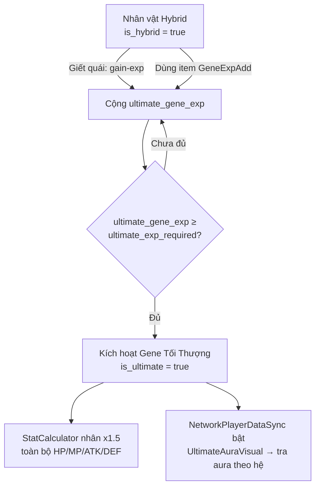

# HƯỚNG DẪN CẤU HÌNH GENE TỐI THƯỢNG (ULTIMATE GENE) TRONG UNITY

Tài liệu này hướng dẫn cấu hình toàn bộ luồng **Gene Tối Thượng** – cấp tiến hóa cao nhất, kích hoạt sau khi nhân vật đã hợp nhất gene (Hybrid Fusion). Khi đạt đủ EXP tích lũy từ việc giết quái và dùng vật phẩm, gene sẽ tự động nâng lên Tối Thượng: hiện **aura sau lưng** và **nhân toàn bộ chỉ số x1.5**.

---

## 1. Tổng quan luồng



**Bảng 1. Các thành phần đã thêm vào hệ thống**

| Lớp | Vai trò |
|-----|---------|
| `GeneUltimateSettings` (Server, config class) | Cấu hình ngưỡng EXP, hệ số nhân, đường dẫn aura fallback — **hardcode trong code, KHÔNG dùng DB** |
| `GeneUltimateConfig` / `GeneUltimateService` (Server) | Đọc config từ `GeneUltimateSettings`, tích lũy EXP, kích hoạt |
| `StatCalculator` (Server) | Nhân x1.5 toàn bộ chỉ số khi `is_ultimate = true` |
| `NetworkPlayerDataSync` (Client) | Đồng bộ `networkIsUltimate` + hệ (`networkElementType`) qua mạng |
| `UltimateAuraDatabase` (Client, **ScriptableObject**) | Map **mỗi cặp Fusion → 1 prefab aura riêng** |
| `UltimateAuraVisual` (Client) | Tra aura theo hệ từ database rồi sinh/huỷ sau lưng nhân vật |

---

## 2. Cấu hình (trong code, không dùng DB)

a) Toàn bộ tham số Gene Tối Thượng nằm trong class `GeneUltimateSettings` tại `GameServerApi/Models/Config/GeneUltimateConfig.cs`. **Không cần bảng DB.**

```csharp
public static class GeneUltimateSettings
{
    public const int    DefaultExpRequired    = 1_000_000; // EXP cần để kích hoạt
    public const float  DefaultStatMultiplier = 1.5f;      // hệ số nhân chỉ số
    public const string DefaultAuraPrefabPath = "Prefabs/Player/Aura/UltimateAura";
}
```

b) **Ý nghĩa các tham số**

**Bảng 2. Tham số `GeneUltimateSettings`**

| Tham số | Kiểu | Mặc định | Mô tả |
|---------|------|----------|-------|
| `DefaultExpRequired` | int | 1000000 | EXP cần để kích hoạt |
| `DefaultStatMultiplier` | float | 1.5 | Hệ số nhân chỉ số (đang dùng tại `StatCalculator`) |
| `DefaultAuraPrefabPath` | string | `Prefabs/Player/Aura/UltimateAura` | Đường dẫn Resources của aura |

c) Muốn chỉnh độ khó, sửa `DefaultExpRequired`; muốn chỉnh sức mạnh, sửa `DefaultStatMultiplier`. Muốn cấu hình riêng theo từng hệ, thêm vào dictionary `Overrides` trong cùng file. **Sửa xong cần build lại server.**

---

## 3. Aura Prefab (mỗi cặp Fusion một aura)

Fusion chỉ có **3 cặp**, mỗi cặp hiển thị 1 aura riêng:

| Cặp | Các hệ | Aura (ví dụ) |
|------|--------|--------------|
| 1 | Fire ↔ Earth | `aura1` |
| 2 | Water ↔ Wood | `aura2` |
| 3 | Metal ↔ Wind | `aura3` |

a) Các prefab aura nằm sẵn trong `Assets/Prefabs/Aura/` (vd `aura1`, `aura2`, `aura3`). Mỗi prefab là một GameObject chứa **ParticleSystem** hoặc **SpriteRenderer** tạo hiệu ứng hào quang.

b) **Lưu ý sorting để aura nằm sau lưng** (script sẽ tự đặt lại order khi spawn, nhưng nên set sẵn):
   - Sorting Layer: cùng layer với sprite nhân vật.
   - Order in Layer: để giá trị nhỏ (script đặt = order nhân vật − 1).

> Vì `UltimateAuraDatabase` (mục 4) tham chiếu prefab **trực tiếp**, aura **không cần** nằm trong `Resources/` và **không cần** đăng ký `NetworkPrefabsList` (nó là con của player, không phải NetworkObject độc lập).

---

## 4. Cấu hình `UltimateAuraDatabase` (ScriptableObject)

a) Trong Project, chuột phải → **Create → Game → Ultimate Aura Database**. Đặt tên ví dụ `UltimateAuraDatabase`.

b) Mở asset vừa tạo trong Inspector:

**Bảng 3a. Trường `UltimateAuraDatabase`**

| Trường | Mô tả |
|--------|-------|
| `Auras` | Danh sách **3 entry** — mỗi entry là một cặp Fusion |
|  `Element Keys` | Các hệ thuộc cặp (vd `Fire`, `Earth`) |
|  `Aura Prefab` | Prefab aura dùng chung cho cả cặp |
| `Default Aura Prefab` | Aura dự phòng khi không khớp hệ (tùy chọn) |

c) Thêm **3 entry** đúng theo 3 cặp:
   - Entry 1: `Element Keys` = `Fire`, `Earth` → `Aura Prefab` = `aura1`.
   - Entry 2: `Element Keys` = `Water`, `Wood` → `Aura Prefab` = `aura2`.
   - Entry 3: `Element Keys` = `Metal`, `Wind` → `Aura Prefab` = `aura3`.

So khớp hệ **không phân biệt hoa thường**.

> Hệ dùng để tra aura là **hệ chính** (primary element) của nhân vật sau khi Fusion — chính là `networkElementType` được đồng bộ sẵn. Cả hai hệ trong cùng cặp đều trỏ về cùng aura.

---

## 5. Gắn `UltimateAuraVisual` vào Player Prefab

a) Mở từng **player prefab** (mọi biến thể element/gender, kể cả prefab Hybrid) mà `ZonePlayerSessionManager` dùng để spawn.

b) Trên GameObject gốc của player (cùng nơi đã có `NetworkPlayerDataSync`), nhấn **Add Component → Ultimate Aura Visual**.

c) Cấu hình các trường trong Inspector:

**Bảng 3b. Tham số `UltimateAuraVisual`**

| Trường | Gợi ý | Mô tả |
|--------|-------|-------|
| Aura Database | (kéo asset ở mục 4) | Database map hệ → aura. **Ưu tiên tra ở đây** |
| Default Aura Resource Path | `Prefabs/Player/Aura/UltimateAura` | Fallback Resources khi database không có entry & server không gửi path |
| Back Offset | `(0, 0, 0)` | Lệch vị trí aura so với nhân vật |
| Sorting Order Offset | `-1` | Âm để aura nằm sau sprite |

d) Lặp lại cho **tất cả** player prefab. `NetworkPlayerDataSync` tự gọi `GetComponent<UltimateAuraVisual>()` nên chỉ cần gắn component, không cần kéo tham chiếu. (`Client_clone_0/Assets` là junction trỏ tới `Client/Assets` nên clone dùng chung cấu hình, không cần làm lại.)

---

## 5b. Hiển thị tiến độ trong tab Thông tin → Thông số

Tiến độ Gene Tối Thượng được **ghép thẳng vào dòng Hệ/Gene Tier** sẵn có của `StatsTabUI` (trường `txtElement`), **không cần thêm TMP_Text mới** — code tự xử lý.

Cách hiển thị tự động trên dòng Hệ:
- Chưa Hybrid → không hiện gì thêm.
- Đang tích lũy → `Hệ Fire (Hybrid)  ★★★★★  (Gene Tier 5)  • Tối Thượng 350,000/1,000,000 (35.0%)`.
- Đã kích hoạt → `… (Gene Tier 5)  • Tối Thượng ✦ (chỉ số ×1.5)`.

> Mốc EXP dùng hằng số `GeneUltimateExpRequired` trong `StatsTabUI.cs` (mặc định `1_000_000`). Nếu đổi `GeneUltimateSettings.DefaultExpRequired` bên server thì sửa hằng số này cho khớp để phần trăm đúng. Khi `ultimate_gene_exp` đạt mốc, server tự bật `is_ultimate` (mục 6) → gene **tự động** lên Tối Thượng.

---

## 6. Đồng bộ mạng (đã code sẵn)

a) `NetworkPlayerDataSync` đã có các NetworkVariable:
   - `networkIsUltimate` (bool) – cờ kích hoạt.
   - `networkUltimateAuraPath` (string) – đường dẫn aura fallback.
   - `networkElementType` (string) – hệ của nhân vật, dùng làm **key tra aura** trong `UltimateAuraDatabase`.

b) Khi player vào zone, server đọc `is_ultimate` + `ultimate_aura_path` từ API và set NetworkVariable → mọi client (chủ + remote) đều thấy aura.

c) Khi gene **vừa kích hoạt lúc đang chơi** (giết quái đủ EXP), phản hồi `gain-exp` trả `ultimate_activated = true`; server bật `networkIsUltimate.Value = true` ngay lập tức → aura hiện tức thì cho tất cả.

> Chỉ số x1.5 được tính ở `StatCalculator` phía server và lưu vào chỉ số nhân vật; giá trị mới sẽ phản ánh đầy đủ ở lần đồng bộ chỉ số kế tiếp (đổi map / đăng nhập lại).

---

## 7. Các bước kiểm thử

a) **Chuẩn bị**: chọn 1 tài khoản đã Hybrid (`is_hybrid = true`).

b) **Kiểm tra config**: gọi `GET /api/gene/ultimate/config?playerId={id}` – kiểm tra `ultimateExpRequired`, `currentUltimateExp`, `isHybrid = true`.

c) **Tích EXP nhanh để test**: tạm hạ `GeneUltimateSettings.DefaultExpRequired` xuống ví dụ `1000` (trong `GameServerApi/Models/Config/GeneUltimateConfig.cs`), build lại server, rồi đi giết quái hoặc dùng item gene-exp.

d) **Quan sát**: khi `ultimate_gene_exp ≥ ngưỡng`, log server in `Gene Tối Thượng KÍCH HOẠT`, aura xuất hiện sau lưng nhân vật trên cả 2 cửa sổ (dùng ParrelSync clone để test multiplayer).

e) **Xác nhận chỉ số**: đổi map hoặc đăng nhập lại, mở bảng chỉ số – HP/MP/ATK/DEF tăng x1.5 so với trước.

f) **Khôi phục**: trả `DefaultExpRequired` về `1_000_000` và build lại sau khi test.

---

## 8. Tổng kết file đã thay đổi

**Bảng 4. Danh sách thay đổi**

| Phía | File |
|------|------|
| Config | `Models/Config/GeneUltimateConfig.cs` (class `GeneUltimateSettings` — hardcode, không dùng DB) |
| Server | `Models/Entities/PlayerData.cs`, `Models/Services/StatCalculator.cs`, `Models/Services/GeneUltimateService.cs`, `Controllers/PlayerController.cs`, `Controllers/GeneController.cs` |
| Client | `Services/Api/APIClient.cs`, `Network/Player/NetworkPlayerDataSync.cs`, `Player/Visuals/UltimateAuraVisual.cs`, `Player/Visuals/UltimateAuraDatabase.cs` (ScriptableObject), `UI/Character/StatsTabUI.cs` (hiển thị tiến độ trong tab Thông số) |

> `Client_clone_0/Assets` là junction trỏ tới `Client/Assets`, nên mọi file Client ở trên dùng chung cho cả clone — không cần sửa riêng.
