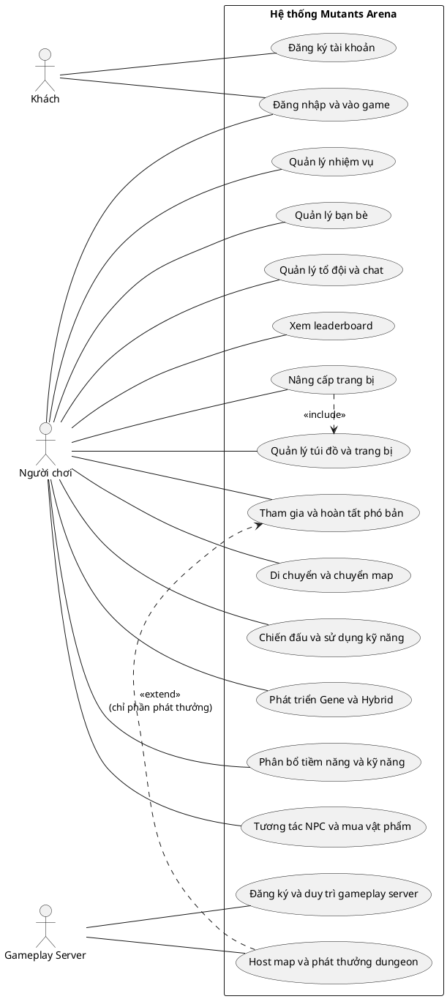

# Hướng dẫn vẽ lại biểu đồ use case chi tiết và chuẩn hóa đặc tả

Tài liệu này dùng để sửa lại bộ biểu đồ use case chi tiết trong thư mục `docs/UseCase` và phần đặc tả đi kèm cho đúng với trạng thái hiện tại của dự án Mutants Arena.

## 1. Kết luận rà soát hiện tại

Bộ use case hiện tại mô tả tương đối đúng các chức năng chính của dự án, nhưng chưa hoàn toàn chuẩn UML vì còn ba vấn đề chính:

1. Actor `Quản trị viên` đang được đưa vào biểu đồ nhưng trong code hiện tại chưa có module admin hoàn chỉnh. Các endpoint như leaderboard refresh chỉ có `[Authorize]`, chưa có role `Admin`; các endpoint quản lý zone server lại dùng role `GameServer`, không phải admin.
2. Actor `Máy chủ` chỉ hợp lệ nếu coi phạm vi biểu đồ là `Backend API / dịch vụ hệ thống`. Nếu phạm vi biểu đồ là toàn bộ game Mutants Arena, `Máy chủ` là thành phần nội bộ và không nên đứng ngoài boundary như actor.
3. Các biểu đồ chi tiết đang vẽ nhiều bước kỹ thuật nội bộ thành use case riêng, ví dụ `Kiểm tra hợp lệ`, `Tạo tài khoản`, `Kiểm tra nguyên liệu`, `Đồng bộ trạng thái`. Những phần này nên đưa vào luồng đặc tả, không nên vẽ thành oval use case.

## 2. Phương án chỉnh thống nhất

Để ít phá vỡ hệ thống đánh số trong báo cáo, nên giữ 16 use case nhưng sửa lại actor và nội dung của nhóm vận hành kỹ thuật:

| Mã | Tên cũ | Tên nên dùng | Actor chính sau sửa | Ghi chú |
|---|---|---|---|---|
| UC14 | Xem leaderboard | Xem leaderboard | Người chơi | Bỏ `Quản trị viên` khỏi UC14 vì chưa có admin role/module rõ ràng. |
| UC15 | Quản lý gameplay server | Đăng ký và duy trì gameplay server | Gameplay Server | Mô tả đúng `ZoneServerController`: register, heartbeat, deregister. |
| UC16 | Host map và phát thưởng dungeon | Host map và phát thưởng dungeon | Gameplay Server | Có thể giữ tên này nếu không muốn đổi số, nhưng trong đặc tả phải tách rõ hai nhánh: host map/config và phát thưởng dungeon. |

Nếu muốn chuẩn UML hơn nữa, có thể tách UC16 thành hai use case:

| Mã đề xuất | Tên use case | Actor chính |
|---|---|---|
| UC16 | Host map và đồng bộ cấu hình map | Gameplay Server |
| UC17 | Phát thưởng dungeon | Gameplay Server |

Tuy nhiên, nếu báo cáo đã đánh số UC01 đến UC16 ở nhiều chỗ, phương án giữ 16 use case sẽ an toàn hơn.

## 3. Quy tắc vẽ lại biểu đồ chi tiết

Khi vẽ lại từng biểu đồ use case chi tiết trong draw.io, tuân thủ các quy tắc sau:

| Quy tắc | Cách áp dụng |
|---|---|
| Actor luôn nằm ngoài boundary | `Khách`, `Người chơi`, `Gameplay Server` đặt ngoài hình chữ nhật hệ thống. |
| Use case là mục tiêu nghiệp vụ | Tên use case nên là hành động có giá trị với actor, ví dụ `Đăng ký tài khoản`, `Nâng cấp trang bị`, `Tham gia phó bản`. |
| Không vẽ xử lý nội bộ thành use case | Các bước như kiểm tra dữ liệu, tính sát thương, ghi log, đồng bộ trạng thái đưa vào đặc tả luồng chính. |
| Chỉ dùng `include` khi bắt buộc và có giá trị tái sử dụng | Ví dụ `Nâng cấp trang bị` có thể include `Quản lý túi đồ và trang bị` nếu muốn thể hiện luôn cần đọc/trừ vật phẩm trong túi. |
| Chỉ dùng `extend` cho luồng có điều kiện | Ví dụ `Phát thưởng dungeon` extend `Tham gia và hoàn tất phó bản` tại điểm mở rộng `Hoàn thành dungeon thành công`. |
| Không nối actor vào use case mà actor không chủ động tham gia | `Quản trị viên` không nối vào UC14, UC15, UC16 nếu chưa có admin module thật. |

## 4. Actor sau khi sửa

| Actor | Dùng trong biểu đồ | Mô tả chuẩn |
|---|---|---|
| Khách | UC01, UC02 | Người dùng chưa xác thực, có thể đăng ký hoặc đăng nhập. |
| Người chơi | UC02 đến UC14 | Người dùng đã đăng nhập và trực tiếp thực hiện gameplay. |
| Gameplay Server | UC15, UC16, có thể là actor phụ của UC13 | Unity/NGO Dedicated Server gọi Backend API bằng `X-Zone-Api-Key` để đăng ký zone, heartbeat, cập nhật vận hành và phát thưởng dungeon. |

Không dùng `Quản trị viên` trong bộ use case hiện tại, trừ khi bổ sung thật các endpoint/UI admin như quản lý người dùng, reset leaderboard, quản lý cấu hình map, khóa tài khoản.

## 5. Hướng dẫn vẽ từng biểu đồ chi tiết

### UC01 - Đăng ký tài khoản

| Thành phần | Nội dung |
|---|---|
| Actor | Khách |
| Use case chính | Đăng ký tài khoản |
| Không vẽ thành use case riêng | Nhập thông tin đăng ký, kiểm tra hợp lệ, tạo tài khoản, mã hóa mật khẩu |
| Đưa vào đặc tả | Các bước nhập username/email/password, validate, kiểm tra trùng, lưu tài khoản |
| Quan hệ | Không cần `include`/`extend` |

### UC02 - Đăng nhập và vào game

| Thành phần | Nội dung |
|---|---|
| Actor | Khách, Người chơi |
| Use case chính | Đăng nhập và vào game |
| Không vẽ thành use case riêng | Xác thực tài khoản, tạo token, chọn nhân vật, kết nối server |
| Đưa vào đặc tả | JWT, chọn/tạo nhân vật, client kết nối gameplay server bằng token |
| Quan hệ | Có thể không cần `include`; nếu muốn chi tiết hơn thì dùng ghi chú trong luồng đặc tả |

Gợi ý: nếu muốn chuẩn hơn, tách `Đăng nhập` và `Vào game` thành hai use case. Nhưng nếu báo cáo đang dùng UC02 gộp thì vẫn chấp nhận được.

### UC03 - Di chuyển và chuyển map

| Thành phần | Nội dung |
|---|---|
| Actor | Người chơi |
| Use case chính | Di chuyển và chuyển map |
| Không vẽ thành use case riêng | Tương tác portal, kiểm tra điều kiện vào map, chuyển zone |
| Đưa vào đặc tả | Portal, min level, required quest, zone capacity, spawn point |
| Quan hệ | Không cần `include`/`extend` |

### UC04 - Chiến đấu và sử dụng kỹ năng

| Thành phần | Nội dung |
|---|---|
| Actor | Người chơi |
| Use case chính | Chiến đấu và sử dụng kỹ năng |
| Không vẽ thành use case riêng | Tấn công thường, kích hoạt kỹ năng, kiểm tra cooldown/mana, tính sát thương, đồng bộ animation |
| Đưa vào đặc tả | Server-authoritative combat, enemy/boss, reward khi hạ mục tiêu |
| Quan hệ | Không cần `include`/`extend` |

### UC05 - Quản lý túi đồ và trang bị

| Thành phần | Nội dung |
|---|---|
| Actor | Người chơi |
| Use case chính | Quản lý túi đồ và trang bị |
| Có thể vẽ use case con nếu thật sự cần | Sử dụng vật phẩm, Trang bị vật phẩm |
| Không vẽ thành use case riêng | Kiểm tra slot, cập nhật chỉ số, serialize inventory JSON |
| Quan hệ | Nếu vẽ `Sử dụng vật phẩm` và `Trang bị vật phẩm`, dùng `include` từ UC05 đến các use case con |

### UC06 - Nâng cấp trang bị

| Thành phần | Nội dung |
|---|---|
| Actor | Người chơi |
| Use case chính | Nâng cấp trang bị |
| Không vẽ thành use case riêng | Chọn trang bị, kiểm tra nguyên liệu, tính tỷ lệ thành công, trừ vàng/vật phẩm |
| Quan hệ nên dùng | `Nâng cấp trang bị` -- `<<include>>` --> `Quản lý túi đồ và trang bị` nếu muốn thể hiện luôn cần truy xuất inventory |
| Đưa vào đặc tả | NPC Blacksmith, `UpgradeController`, success rate, fail policy |

### UC07 - Phát triển Gene và Hybrid

| Thành phần | Nội dung |
|---|---|
| Actor | Người chơi |
| Use case chính | Phát triển Gene và Hybrid |
| Có thể tách trong sơ đồ chi tiết | Nâng Gene chính, Chọn/Nâng Gene phụ, Dung hợp Hybrid |
| Không vẽ thành use case riêng | Kiểm tra gene exp, kiểm tra Fusion Core, cập nhật stats |
| Quan hệ | Nếu tách, dùng `include` từ UC07 đến các use case con vì đây là các chức năng thuộc nhóm phát triển gene |

### UC08 - Phân bổ tiềm năng và kỹ năng

| Thành phần | Nội dung |
|---|---|
| Actor | Người chơi |
| Use case chính | Phân bổ tiềm năng và kỹ năng |
| Có thể tách trong sơ đồ chi tiết | Phân bổ điểm tiềm năng, Nâng cấp kỹ năng, Sắp xếp kỹ năng |
| Không vẽ thành use case riêng | Kiểm tra điểm còn lại, kiểm tra gene tier yêu cầu, lưu HUD |
| Quan hệ | Có thể dùng `include` nếu vẽ các chức năng con |

### UC09 - Tương tác NPC và mua vật phẩm

| Thành phần | Nội dung |
|---|---|
| Actor | Người chơi |
| Use case chính | Tương tác NPC và mua vật phẩm |
| Có thể tách trong sơ đồ chi tiết | Mở hội thoại NPC, Mua vật phẩm, Sử dụng dịch vụ NPC |
| Không vẽ thành use case riêng | Kiểm tra khoảng cách, kiểm tra vàng, kiểm tra shop config |
| Quan hệ | `Mua vật phẩm` có thể `include` `Quản lý túi đồ và trang bị` nếu muốn thể hiện thêm item vào túi |

### UC10 - Quản lý nhiệm vụ

| Thành phần | Nội dung |
|---|---|
| Actor | Người chơi |
| Use case chính | Quản lý nhiệm vụ |
| Có thể tách trong sơ đồ chi tiết | Nhận nhiệm vụ, Theo dõi tiến độ, Hoàn thành nhiệm vụ, Hủy nhiệm vụ |
| Không vẽ thành use case riêng | Kiểm tra level, kiểm tra quest trước, cập nhật quest progress |
| Quan hệ | Các use case con có thể nối trực tiếp với `Người chơi`, không bắt buộc dùng `include` |

### UC11 - Quản lý bạn bè

| Thành phần | Nội dung |
|---|---|
| Actor | Người chơi |
| Use case chính | Quản lý bạn bè |
| Có thể tách trong sơ đồ chi tiết | Tìm người chơi, Gửi lời mời kết bạn, Chấp nhận lời mời, Xóa bạn |
| Không vẽ thành use case riêng | Kiểm tra trùng quan hệ, cập nhật trạng thái online |
| Quan hệ | Có thể nối actor trực tiếp tới từng use case con hoặc dùng UC11 tổng quát với `include` |

### UC12 - Quản lý tổ đội và chat

| Thành phần | Nội dung |
|---|---|
| Actor | Người chơi |
| Use case chính | Quản lý tổ đội và chat |
| Có thể tách trong sơ đồ chi tiết | Tạo tổ đội, Mời thành viên, Rời/Giải tán tổ đội, Gửi tin nhắn |
| Không vẽ thành use case riêng | SignalR routing, group membership, lọc kênh chat |
| Quan hệ | `Tham gia phó bản` có thể liên hệ với `Quản lý tổ đội` bằng ghi chú, không bắt buộc vẽ relation |

### UC13 - Tham gia và hoàn tất phó bản

| Thành phần | Nội dung |
|---|---|
| Actor chính | Người chơi |
| Actor phụ | Gameplay Server nếu biểu đồ lấy phạm vi Backend API/dịch vụ hệ thống |
| Use case chính | Tham gia và hoàn tất phó bản |
| Không vẽ thành use case riêng | Kiểm tra lượt vào, spawn wave, spawn boss, cập nhật session |
| Quan hệ nên dùng | `Phát thưởng dungeon` có thể `extend` UC13 tại điểm mở rộng `Hoàn thành dungeon thành công` |
| Đưa vào đặc tả | Dungeon solo/party, wave, boss, daily entry, kết quả thành công/thất bại |

Nếu giữ UC16 là `Host map và phát thưởng dungeon`, không nối `UC16 <<extend>> UC13` theo nghĩa toàn bộ UC16. Chỉ phần `Phát thưởng dungeon` mới có quan hệ `extend` với UC13.

### UC14 - Xem leaderboard

| Thành phần | Nội dung |
|---|---|
| Actor | Người chơi |
| Use case chính | Xem leaderboard |
| Bỏ khỏi sơ đồ | Quản trị viên |
| Không vẽ thành use case riêng | Refresh cache, tính ranking, serialize danh sách |
| Đưa vào đặc tả | Xem theo hạng level, quest, attendance, dungeon, gold; cache tự refresh khi stale |

Lý do bỏ admin: `LeaderboardController.Refresh()` hiện chỉ yêu cầu `[Authorize]`, chưa có `[Authorize(Roles = "Admin")]` và chưa có màn hình admin.

### UC15 - Đăng ký và duy trì gameplay server

| Thành phần | Nội dung |
|---|---|
| Actor | Gameplay Server |
| Use case chính | Đăng ký và duy trì gameplay server |
| Không dùng actor | Quản trị viên |
| Có thể tách trong sơ đồ chi tiết | Đăng ký server, Gửi heartbeat, Hủy đăng ký server |
| Đưa vào đặc tả | `POST /api/zone/server/register`, `PUT /api/zone/server/heartbeat`, `DELETE /api/zone/server/deregister`, role `GameServer` |

Đây là use case kỹ thuật. Chỉ giữ trong báo cáo nếu phần phân tích của bạn chấp nhận mô hình hóa `Gameplay Server` như một actor ngoài của Backend API.

### UC16 - Host map và phát thưởng dungeon

| Thành phần | Nội dung |
|---|---|
| Actor | Gameplay Server |
| Use case chính nếu giữ 16 UC | Host map và phát thưởng dungeon |
| Cách vẽ chuẩn hơn | Tách thành hai oval trong cùng sơ đồ: `Host map và đồng bộ cấu hình map`, `Phát thưởng dungeon` |
| Không dùng actor | Quản trị viên |
| Quan hệ với UC13 | Chỉ `Phát thưởng dungeon` `extend` `Tham gia và hoàn tất phó bản`; không dùng toàn bộ UC16 để extend UC13 |
| Đưa vào đặc tả | `MapController` host endpoints, `DungeonRewardController.Grant()`, `X-Zone-Api-Key` |

Nếu được phép đổi số use case, nên đổi thành:

| Mã | Use case | Quan hệ |
|---|---|---|
| UC16 | Host map và đồng bộ cấu hình map | Độc lập với UC13 |
| UC17 | Phát thưởng dungeon | `UC17 --<<extend>>--> UC13` |

## 6. Quan hệ include/extend nên dùng sau chỉnh sửa

| Use case nguồn | Use case đích | Loại | Có nên giữ? | Lý do |
|---|---|---|---|---|
| Nâng cấp trang bị | Quản lý túi đồ và trang bị | `include` | Có thể giữ | Nâng cấp luôn cần đọc/trừ item trong inventory. |
| Phát thưởng dungeon | Tham gia và hoàn tất phó bản | `extend` | Nên dùng nếu tách riêng phần phát thưởng | Phát thưởng chỉ xảy ra tại điểm mở rộng `dungeon hoàn thành thành công`. |
| Host map và phát thưởng dungeon | Tham gia và hoàn tất phó bản | `extend` | Không nên giữ nguyên | `Host map` không phải luồng mở rộng của dungeon; chỉ `Phát thưởng dungeon` mới liên quan trực tiếp. |
| Xem leaderboard | Refresh leaderboard cache | `include` hoặc `extend` | Không nên vẽ | Refresh cache là xử lý nội bộ backend. |
| Đăng nhập | Xác thực tài khoản | `include` | Không cần vẽ | Xác thực là bước bắt buộc trong luồng chính, không phải mục tiêu độc lập của actor. |

## 7. Mẫu đặc tả chuẩn cho từng use case

Khi sửa `mutants_arena_usecase_dacta.md`, mỗi use case nên dùng cùng một mẫu để tránh thiếu ý:

```markdown
#### UCxx - Tên use case

| Thuộc tính | Nội dung |
|---|---|
| Mã use case | UCxx |
| Tên use case | ... |
| Nhóm chức năng | ... |
| Mục tiêu | Actor đạt được kết quả gì sau khi use case thành công. |
| Actor chính | ... |
| Actor phụ | ... hoặc Không có |
| Sự kiện kích hoạt | Hành động bắt đầu use case. |
| Tiền điều kiện | Điều kiện phải đúng trước khi bắt đầu. |
| Hậu điều kiện thành công | Trạng thái hệ thống sau khi thành công. |
| Hậu điều kiện thất bại | Trạng thái hệ thống khi bị từ chối/lỗi. |
| Luồng chính | 1. ... 2. ... 3. ... |
| Luồng thay thế/ngoại lệ | A1. ... E1. ... |
| Quy tắc nghiệp vụ | Các giới hạn level, slot, cooldown, lượt vào, tỷ lệ thành công... |
| Use case liên quan | `include`/`extend` nếu có, nếu không ghi Không có. |
| API/code liên quan | Controller, endpoint, class Unity liên quan. |
```

## 8. Bảng kiểm tra đặc tả hiện tại

| Mã | Đánh giá hiện tại | Cần sửa |
|---|---|---|
| UC01 | Nội dung đúng nhưng sơ đồ chi tiết đang vẽ nhiều xử lý nội bộ | Bỏ các oval `Nhập thông tin`, `Kiểm tra hợp lệ`, `Tạo tài khoản`; đưa vào luồng chính. |
| UC02 | Đúng chức năng | Bỏ các oval kỹ thuật nếu muốn chuẩn UML hơn; mô tả JWT và chọn nhân vật trong đặc tả. |
| UC03 | Đúng chức năng | Chuyển `Tương tác portal`, `Kiểm tra điều kiện`, `Chuyển zone` vào luồng chính. |
| UC04 | Đúng chức năng | Không vẽ `Đồng bộ trạng thái` thành use case riêng; đưa vào luồng chính. |
| UC05 | Đúng chức năng | Có thể giữ các use case con nếu chúng là hành động người chơi thấy được. |
| UC06 | Đúng chức năng | Giữ hoặc bỏ quan hệ `include` UC05 đều được; nếu giữ phải giải thích là truy xuất inventory bắt buộc. |
| UC07 | Đúng chức năng | Nếu sơ đồ quá rối, tách thành 3 use case con: gene chính, gene phụ, hybrid fusion. |
| UC08 | Đúng chức năng | Đặc tả cần nhắc rõ nâng kỹ năng và phân bổ tiềm năng là hai nhánh thao tác khác nhau. |
| UC09 | Đúng chức năng | Không biến kiểm tra vàng/shop config thành use case riêng. |
| UC10 | Đúng chức năng | Có thể tách nhận, theo dõi, hoàn thành, hủy nhiệm vụ. |
| UC11 | Đúng chức năng | Đặc tả hiện tại có cấu trúc tốt hơn các UC trước; nên đồng bộ mẫu này cho toàn bộ UC. |
| UC12 | Đúng chức năng | Nên tách rõ party và chat trong luồng hoặc sơ đồ con. |
| UC13 | Đúng chức năng | Actor chính là Người chơi; Gameplay Server chỉ là actor phụ nếu đang mô hình Backend API. |
| UC14 | Chưa chuẩn vì có Quản trị viên | Bỏ Quản trị viên, chỉ để Người chơi xem leaderboard. Refresh cache là xử lý nội bộ. |
| UC15 | Chưa chuẩn vì có Quản trị viên | Đổi thành `Đăng ký và duy trì gameplay server`, actor chính là Gameplay Server. |
| UC16 | Chưa chuẩn vì gộp host map và phát thưởng | Tách ý trong đặc tả; nếu vẽ quan hệ với UC13 thì chỉ dùng phần `Phát thưởng dungeon`. |

## 9. Gợi ý sơ đồ tổng quan sau chỉnh sửa

Nếu giữ 16 use case, có thể dùng cấu trúc PlantUML sau để tham khảo khi vẽ lại tổng quan:



Nếu tách thành 17 use case, thay UC16 bằng:

```plantuml
usecase "Host map và đồng bộ cấu hình map" as UC16
usecase "Phát thưởng dungeon" as UC17
UC17 .> UC13 : <<extend>>
GameServer -- UC16
GameServer -- UC17
```

## 10. Checklist trước khi đưa vào `DoAn.docx`

Trước khi chèn lại hình vào báo cáo, kiểm tra từng biểu đồ bằng checklist này:

- Boundary có tên rõ ràng và bao quanh toàn bộ use case.
- Actor nằm ngoài boundary.
- Không còn actor `Quản trị viên` nếu chưa bổ sung chức năng admin thật.
- Không còn các use case thuần kỹ thuật như `Kiểm tra hợp lệ`, `Tạo token`, `Ghi log`, `Serialize JSON`.
- Mỗi oval là một mục tiêu actor có thể hiểu được.
- Quan hệ `include` có mũi tên từ use case chính sang use case được dùng bắt buộc.
- Quan hệ `extend` có mũi tên từ use case mở rộng sang use case nền.
- UC14 chỉ nối với `Người chơi`.
- UC15 và UC16 chỉ nối với `Gameplay Server` nếu vẫn giữ nhóm vận hành kỹ thuật.
- Đặc tả không ghi actor hoặc quyền không tồn tại trong code.
- Tên use case trong sơ đồ, bảng tổng hợp và bảng đặc tả phải giống nhau.

## 11. Đoạn sửa nhanh cho phần nhận xét trong báo cáo

Có thể dùng đoạn sau trong báo cáo để giải thích cách mô hình hóa actor kỹ thuật:

> Trong phạm vi biểu đồ use case, `Gameplay Server` được mô hình hóa như một tác nhân kỹ thuật tương tác với Backend API thông qua các endpoint nội bộ được bảo vệ bằng `X-Zone-Api-Key`. Tác nhân này không đại diện cho người dùng cuối mà đại diện cho tiến trình Unity/NGO Dedicated Server thực hiện đăng ký trạng thái hoạt động, gửi heartbeat, đồng bộ cấu hình map và yêu cầu phát thưởng dungeon sau khi phiên chơi kết thúc. Vì dự án hiện chưa triển khai module quản trị riêng, actor `Quản trị viên` không được đưa vào biểu đồ use case chức năng.

