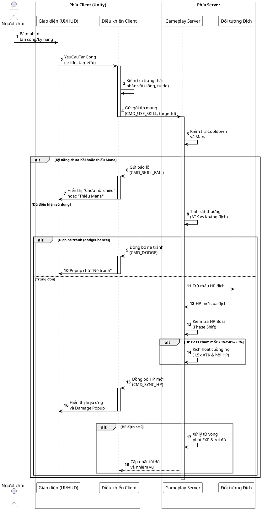
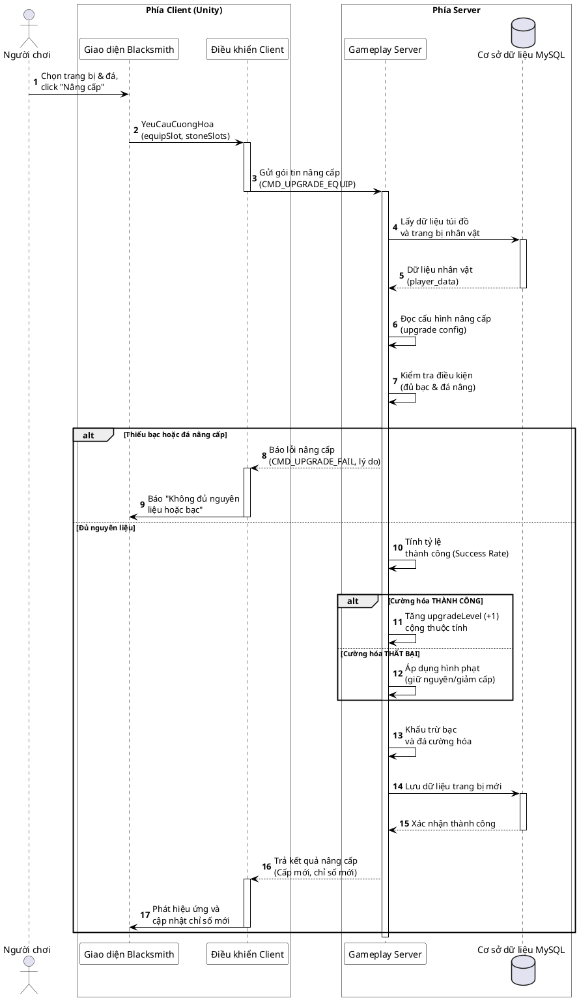
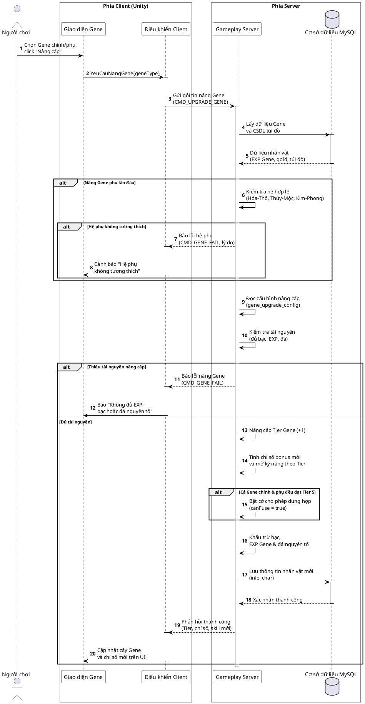
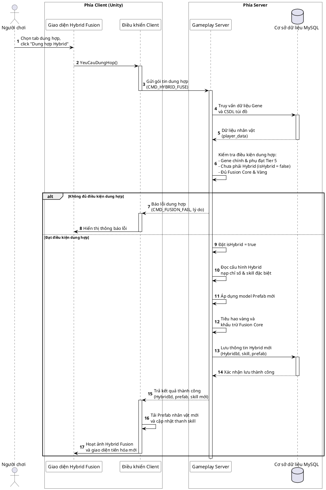
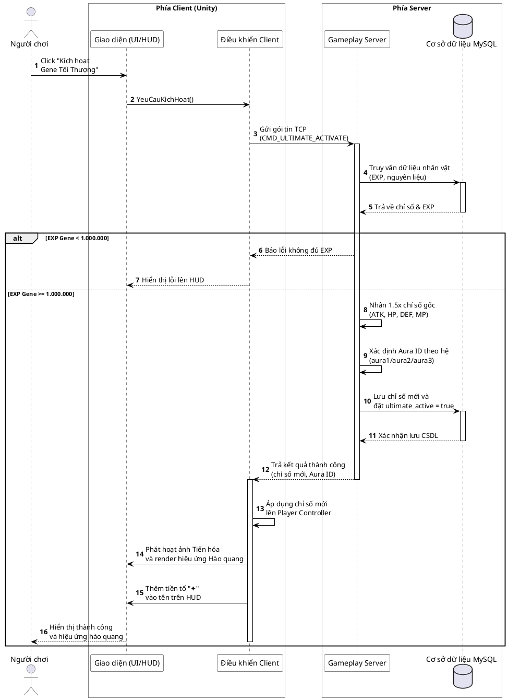
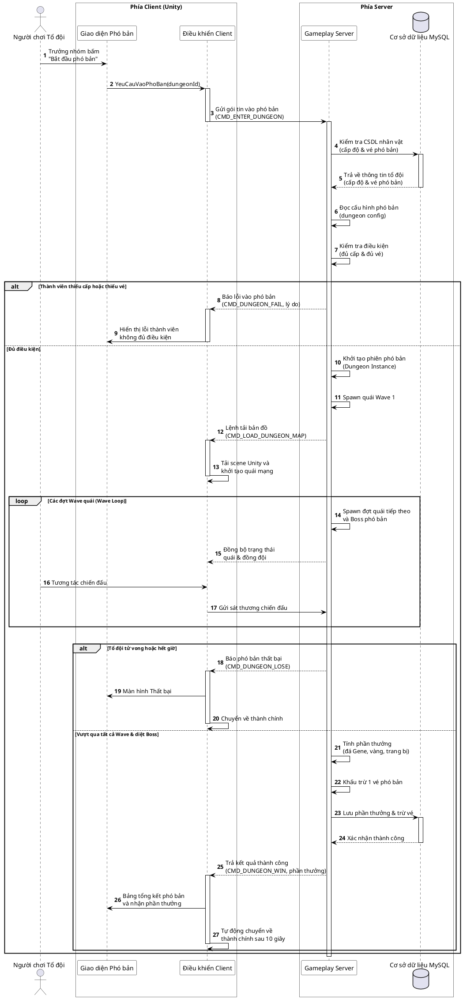

# BÁO CÁO PHÂN TÍCH VÀ ĐÁNH GIÁ ĐỒ ÁN — MUTANTS ARENA (CẬP NHẬT THEO WORD)
*Tài liệu hướng dẫn bổ sung chi tiết, sửa đổi hình vẽ và đặc tả ca sử dụng theo đúng số thứ tự và số trang trong file Word DoAn.docx.*

---

## I. DANH SÁCH CÁC HÌNH VÀ BẢNG CẦN THAY THẾ / THÊM MỚI TRONG WORD (`DoAn.docx`)

Để nâng cấp đồ án từ mức cơ bản lên mức chi tiết hóa nghiệp vụ, các hình vẽ Use Case và Sequence đơn giản hiện tại cần được thay thế bằng các sơ đồ đã được kết xuất (render) sẵn dưới đây. Các sơ đồ này đã được lưu vào thư mục `docs/refined_images/` trong thư mục đồ án của bạn dưới dạng ảnh PNG chất lượng cao để bạn dễ dàng chèn vào Word.

### 1. Thay thế Hình 2.2: Biểu đồ ca sử dụng mức tổng quát
*   **Vị trí trong Word:** Chương 2, Mục 2.2.2, Trang 35.
*   **Ảnh mới cần chèn:** `docs/refined_images/refined_usecase_general.png`
*   **Mục tiêu:** Thể hiện rõ các nhóm Use Case chính của Khách, Người chơi và Gameplay Server, kèm quan hệ `«include»` và `«extend»`.
*   **Sơ đồ trực quan:**
    

---

### 1a. Thay thế Hình 2.3 & Bảng 2.2: Phân hệ Đăng ký tài khoản
*   **Vị trí trong Word:** Chương 2, Mục 2.2.3.1 (Nhóm 1 - Khởi tạo và kết nối), Trang 36.
*   **Ảnh mới cần chèn (Hình 2.3):** `docs/refined_images/refined_usecase_register.png`
*   **Bảng mới cần thay (Bảng 2.2):** Xem đặc tả chi tiết ở Mục II.0 báo cáo này.
*   **Mục tiêu:** Thể hiện rõ việc đăng ký tài khoản đi kèm các thao tác bắt buộc gồm kiểm tra trùng lặp dữ liệu (`«include»`), băm mật khẩu (`«include»`) và lưu tài khoản vào cơ sở dữ liệu (`«include»`).
*   **Sơ đồ trực quan:**
    

---

### 2. Thay thế Hình 2.4 & Bảng 2.3: Phân hệ Đăng nhập và vào game
*   **Vị trí trong Word:** Chương 2, Mục 2.2.3.1 (Nhóm 1 - Khởi tạo và kết nối), Trang 37.
*   **Ảnh mới cần chèn (Hình 2.4):** `docs/refined_images/refined_usecase_login.png`
*   **Bảng mới cần thay (Bảng 2.3):** Xem đặc tả chi tiết ở Mục II.1 báo cáo này.
*   **Mục tiêu:** Làm rõ việc đăng nhập bắt buộc phải đi kèm xác thực JWT (`«include»`) và chọn nhân vật, đồng thời hỗ trợ rẽ nhánh tạo nhân vật mới (`«extend»`).
*   **Sơ đồ trực quan:**
    

---

### 3. Thay thế Hình 2.6 & Bảng 2.5: Phân hệ Chiến đấu và sử dụng kỹ năng
*   **Vị trí trong Word:** Chương 2, Mục 2.2.3.1 (Nhóm 1 - Khởi tạo và kết nối), Trang 39.
*   **Ảnh mới cần chèn (Hình 2.6):** `docs/refined_images/refined_usecase_combat.png`
*   **Bảng mới cần thay (Bảng 2.5):** Xem đặc tả chi tiết ở Mục II.2 báo cáo này.
*   **Mục tiêu:** Thêm cơ chế kiểm tra tài nguyên MP/Cooldown trước khi tấn công (`«include»`) và cơ chế chuyển đổi trạng thái Boss (Phase Shift) khi HP tụt dốc (`«extend»`).
*   **Sơ đồ trực quan:**
    

---

### 4. Thay thế Hình 2.9 & Bảng 2.8: Phân hệ Phát triển Gene và Hybrid
*   **Vị trí trong Word:** Chương 2, Mục 2.2.3.2 (Nhóm 2 - Phát triển nhân vật), Trang 43.
*   **Ảnh mới cần chèn (Hình 2.9):** `docs/refined_images/refined_usecase_gene.png`
*   **Bảng mới cần thay (Bảng 2.8):** Xem đặc tả chi tiết ở Mục II.3 báo cáo này.
*   **Mục tiêu:** Thể hiện việc nâng cấp yêu cầu kiểm tra kho đồ và bạc (`«include»`), đồng thời dung hợp Hybrid mở rộng đến kích hoạt Tiến hóa Gene Tối Thượng (`«extend»`).
*   **Sơ đồ trực quan:**
    

---

### 5. Thay thế Hình 2.15 & Bảng 2.14: Phân hệ Tham gia và hoàn tất phó bản
*   **Vị trí trong Word:** Chương 2, Mục 2.2.3.3 (Nhóm 3 - Tương tác và hoạt động), Trang 51.
*   **Ảnh mới cần chèn (Hình 2.15):** `docs/refined_images/refined_usecase_dungeon.png`
*   **Bảng mới cần thay (Bảng 2.14):** Xem đặc tả chi tiết ở Mục II.4 báo cáo này.
*   **Mục tiêu:** Thể hiện rõ việc kiểm tra vé/cấp độ (`«include»`) và việc Server tự động host map kiêm phát thưởng phó bản khi hoàn tất Wave (`«extend»`).
*   **Sơ đồ trực quan:**
    

---

### 6. Thay thế Hình 2.19: Biểu đồ tuần tự Chiến đấu và sử dụng kỹ năng
*   **Vị trí trong Word:** Chương 2, Mục 2.2.4.1, Trang 60.
*   **Ảnh mới cần chèn:** `docs/refined_images/refined_sequence_combat.png`
*   **Mục tiêu:** Thể hiện rõ các bước gửi lệnh tấn công từ client, kiểm tra cooldown/mana ở server, rẽ nhánh xử lý né tránh/trúng đòn, và xử lý chuyển phase của Boss AI.
*   **Mã nguồn sơ đồ (PlantUML):**

*   **Luồng xử lý tuần tự chi tiết:**
    1. Người chơi nhấn phím tắt kỹ năng hoặc click chuột tấn công thường.
    2. UI chuyển tiếp tham số đến lớp Điều khiển Client.
    3. Client tự kiểm tra trạng thái di chuyển/choáng của bản thân.
    4. Client gửi gói tin `CMD_USE_SKILL` lên Gameplay Server.
    5. Server kiểm tra Cooldown của kỹ năng đó và chỉ số Mana hiện thời.
    6. Nếu cooldown chưa xong hoặc thiếu mana, server phản hồi lỗi `CMD_SKILL_FAIL` để client báo lỗi lên UI.
    7. Nếu thỏa mãn, server tính toán sát thương dựa trên thuộc tính kháng và giáp của mục tiêu.
    8. Nếu mục tiêu kích hoạt tỷ lệ né tránh, server gửi gói tin `CMD_DODGE` để client làm nổi chữ "Né tránh".
    9. Nếu trúng đòn, server trừ máu trực tiếp trên thực thể địch.
    10. Server kiểm tra máu Boss hiện tại để xem có cần đổi trạng thái hành vi Boss (Phase Shift) khi HP dưới 75%, 50%, 25% không.
    11. Server gửi gói tin `CMD_SYNC_HP` đồng bộ máu mới và lượng sát thương về client.
    12. Client hiển thị hoạt ảnh kỹ năng và hiệu ứng số sát thương trồi lên.
    13. Nếu địch tử vong, server xử lý phát kinh nghiệm, rơi đồ và đồng bộ cập nhật túi đồ/tiến độ nhiệm vụ.
*   **Sơ đồ trực quan:**
    

---

### 7. Thay thế Hình 2.20: Biểu đồ tuần tự Nâng cấp trang bị tại Blacksmith
*   **Vị trí trong Word:** Chương 2, Mục 2.2.4.2, Trang 61.
*   **Ảnh mới cần chèn:** `docs/refined_images/refined_sequence_upgrade.png`
*   **Mục tiêu:** Thể hiện rõ luồng truy vấn dữ liệu thô, xác thực điều kiện nâng cấp (bạc, đá cường hóa), rẽ nhánh kết quả thành công/thất bại và lưu CSDL MySQL.
*   **Mã nguồn sơ đồ (PlantUML):**

*   **Luồng xử lý tuần tự chi tiết:**
    1. Người chơi chọn trang bị và đá nâng cấp trong rương thợ rèn, click "Nâng cấp".
    2. Giao diện thợ rèn gọi hàm yêu cầu cường hóa gửi tham số các slot rương đến client.
    3. Client gửi gói tin `CMD_UPGRADE_EQUIP` lên server.
    4. Server truy vấn CSDL MySQL để tải thông tin túi đồ, trang bị và tài nguyên bạc của người chơi.
    5. Server truy cập tệp cấu hình nâng cấp để lấy thông tin tỷ lệ thành công, lượng bạc và đá cần có cho cấp độ hiện tại.
    6. Server kiểm tra xem người chơi có thực sự sở hữu đủ bạc và đá nâng cấp trong túi đồ không.
    7. Nếu thiếu tài nguyên, server gửi gói tin `CMD_UPGRADE_FAIL` để client báo lỗi.
    8. Nếu đủ, server thực hiện tính toán kết quả ngẫu nhiên dựa trên tỷ lệ thành công của cấp độ.
    9. Nếu thành công, cấp độ cường hóa được tăng thêm 1 và ngẫu nhiên cộng thêm chỉ số thuộc tính.
    10. Nếu thất bại, hệ thống áp dụng chính sách phạt (failPolicy) như giữ nguyên cấp độ hoặc tụt cấp độ.
    11. Server trừ bạc và tiêu hủy các viên đá cường hóa trong túi đồ của người chơi, sau đó cập nhật dữ liệu mới vào CSDL MySQL.
    12. Server gửi phản hồi kết quả cường hóa về client.
    13. Client cập nhật rương đồ, hiển thị hiệu ứng cường hóa thợ rèn tương ứng lên UI.
*   **Sơ đồ trực quan:**
    

---

### 8. Thay thế Hình 2.21: Biểu đồ tuần tự Nâng Gene chính và Gene phụ
*   **Vị trí trong Word:** Chương 2, Mục 2.2.4.3, Trang 62.
*   **Ảnh mới cần chèn:** `docs/refined_images/refined_sequence_gene.png`
*   **Mục tiêu:** Mô tả luồng nâng cấp Tier Gene chính/phụ, kiểm tra cặp hệ tương thích nguyên tố và kích hoạt cờ cho phép dung hợp `canFuse`.
*   **Mã nguồn sơ đồ (PlantUML):**

*   **Luồng xử lý tuần tự chi tiết:**
    1. Người chơi tương tác trên giao diện cây Gene, chọn Gene chính/phụ và click "Nâng cấp".
    2. Giao diện gọi hàm yêu cầu nâng Gene trên client.
    3. Client gửi gói tin mạng `CMD_UPGRADE_GENE` lên server.
    4. Server lấy dữ liệu nhân vật (`player_data`) từ CSDL MySQL để kiểm tra lượng EXP Gene, bạc và Đá nguyên tố đang có.
    5. Nếu là nâng Gene phụ lần đầu, server kiểm tra xem hệ phụ có thuộc cặp hệ tương khắc hợp lệ (Hỏa-Thổ, Thủy-Mộc, Kim-Phong) hay không. Nếu không, trả về lỗi ngay lập tức.
    6. Server tra cứu bảng cấu hình nâng Gene tương thích để lấy lượng tài nguyên yêu cầu cho cấp độ Tier tiếp theo.
    7. Server kiểm tra xem tài nguyên của nhân vật có đủ điều kiện nâng cấp hay không.
    8. Nếu thiếu tài nguyên, server gửi gói tin lỗi `CMD_GENE_FAIL` về client để thông báo.
    9. Nếu đủ, server tăng cấp Tier Gene lên 1, cộng thêm chỉ số tương ứng và mở khóa kỹ năng của Tier mới.
    10. Nếu cả Gene chính và Gene phụ đều đã đạt cấp độ Tier 5, server tự động bật cờ cho phép dung hợp `canFuse = true`.
    11. Server khấu trừ tài nguyên và lưu trạng thái nhân vật mới vào CSDL MySQL.
    12. Server gửi phản hồi thành công kèm chỉ số và kỹ năng mới về client.
    13. Client hiển thị hiệu ứng tiến hóa trên UI và cập nhật cây thuộc tính mới.
*   **Sơ đồ trực quan:**
    

---

### 9. Thay thế Hình 2.22: Biểu đồ tuần tự Dung hợp Hybrid Gene
*   **Vị trí trong Word:** Chương 2, Mục 2.2.4.4, Trang 62.
*   **Ảnh mới cần chèn:** `docs/refined_images/refined_sequence_hybrid.png`
*   **Mục tiêu:** Minh họa điều kiện để dung hợp Hybrid (cần cả hai hệ đạt Tier 5), lưu trữ HybridId, nạp kỹ năng đặc biệt và thay đổi model nhân vật qua Prefab mới.
*   **Mã nguồn sơ đồ (PlantUML):**

*   **Luồng xử lý tuần tự chi tiết:**
    1. Người chơi mở giao diện dung hợp, bấm nút "Dung hợp Hybrid".
    2. Giao diện gọi yêu cầu dung hợp đến lớp Điều khiển Client.
    3. Client gửi gói tin `CMD_HYBRID_FUSE` lên Gameplay Server.
    4. Server truy vấn CSDL để lấy thông tin nhân vật bao gồm trạng thái Gene chính/phụ, cờ `isHybrid` và số lượng lõi dung hợp (Fusion Core).
    5. Server kiểm tra điều kiện: Gene chính và Gene phụ đạt Tier 5, chưa phải Hybrid, đủ Fusion Core và vàng.
    6. Nếu một trong các điều kiện không đáp ứng, server gửi gói tin lỗi `CMD_FUSION_FAIL` để client báo lỗi.
    7. Nếu đủ điều kiện, server chuyển thuộc tính `isHybrid` thành `true`.
    8. Server đọc dữ liệu Hybrid để thêm chỉ số kháng nguyên tố, chỉ số bonus và kỹ năng Hybrid đặc biệt.
    9. Server chỉ định Prefab nhân vật Hybrid mới để thay đổi ngoại hình hiển thị.
    10. Server khấu trừ Fusion Core và lượng vàng yêu cầu trong túi đồ của nhân vật.
    11. Server lưu trữ dữ liệu nhân vật và kỹ năng mới vào CSDL MySQL.
    12. Server gửi phản hồi thành công kèm ID Hybrid, tên Prefab mới và kỹ năng mới về client.
    13. Client tải prefab nhân vật mới lên màn hình và cập nhật giao diện kỹ năng Hybrid tương ứng.
*   **Sơ đồ trực quan:**
    

---

### 9a. Thêm mới Hình 2.22a: Biểu đồ tuần tự Kích hoạt Gene Tối Thượng
*   **Vị trí trong Word:** Chương 2, Mục 2.2.4.4a, Trang 63 (chèn sau Hình 2.22).
*   **Ảnh mới cần chèn:** `docs/refined_images/refined_sequence_ultimate_gene.png`
*   **Mục tiêu:** Thể hiện đầy đủ luồng nghiệp vụ chi tiết của chức năng Kích hoạt Gene Tối Thượng (kiểm tra 1,000,000 EXP, server nhân 1.5x chỉ số gốc, lưu DB, và client render hiệu ứng Hào quang trên HUD).
*   **Mã nguồn sơ đồ (PlantUML):**

*   **Luồng xử lý tuần tự chi tiết:**
    1. Người chơi click nút "Kích hoạt Gene Tối Thượng" trên UI.
    2. Client gửi gói tin `CMD_ULTIMATE_ACTIVATE` đến Gameplay Server.
    3. Server truy vấn CSDL MySQL để kiểm tra điểm tích lũy EXP Gene tối thượng của nhân vật.
    4. Nếu điểm EXP Gene thấp hơn 1.000.000, server từ chối và phản hồi lỗi để client hiển thị lên HUD.
    5. Nếu đạt tối thiểu 1.000.000 EXP, server tiến hành nhân 1.5x chỉ số gốc (ATK, HP, DEF, MP).
    6. Server xác định ID Hào quang (Aura ID) dựa trên hệ nguyên tố tương ứng của nhân vật.
    7. Server lưu thông tin cập nhật chỉ số và bật cờ `ultimate_active = true` vào MySQL.
    8. Server gửi gói tin phản hồi thành công kèm theo chỉ số mới và Aura ID về client.
    9. Client nạp chỉ số mới vào Player Controller, hiển thị hiệu ứng Hào quang tương thích và thêm ký tự `✦` vào đầu tên nhân vật trên HUD.
*   **Sơ đồ trực quan:**
    

---

### 10. Thay thế Hình 2.23: Biểu đồ tuần tự Tham gia và hoàn tất phó bản
*   **Vị trí trong Word:** Chương 2, Mục 2.2.4.5, Trang 63.
*   **Ảnh mới cần chèn:** `docs/refined_images/refined_sequence_dungeon.png`
*   **Mục tiêu:** Mô tả chi tiết kịch bản bắt đầu phó bản, vòng lặp Wave quái mạng, rẽ nhánh kết quả (thắng lợi phát thưởng & trừ vé; hoặc thất bại/hết giờ thì không được thưởng và quay về thành).
*   **Mã nguồn sơ đồ (PlantUML):**

*   **Luồng xử lý tuần tự chi tiết:**
    1. Trưởng nhóm mở giao diện phó bản và click "Bắt đầu phó bản".
    2. Client gửi yêu cầu vào phó bản `CMD_ENTER_DUNGEON` lên server.
    3. Server kiểm tra CSDL nhân vật để xác thực cấp độ và vé phó bản của các thành viên trong tổ đội.
    4. Nếu có thành viên không đủ điều kiện, server gửi lỗi `CMD_DUNGEON_FAIL` chỉ rõ thành viên thiếu điều kiện.
    5. Nếu đủ điều kiện, server khởi tạo phiên phó bản chuyên biệt (Dungeon Instance) và spawn đợt quái đầu tiên.
    6. Server gửi lệnh chuyển bản đồ `CMD_LOAD_DUNGEON_MAP` về các client.
    7. Client tải bản đồ Unity và khởi tạo quái mạng.
    8. Các Wave quái tiếp tục tự động spawn theo cấu hình thời gian. Client gửi gói tin chiến đấu và sát thương lên server.
    9. Nếu toàn bộ tổ đội bị hạ gục hoặc phó bản hết giờ, server gửi thông báo thất bại `CMD_DUNGEON_LOSE` và dịch chuyển mọi người về thành chính.
    10. Nếu tiêu diệt thành công toàn bộ quái và Boss cuối, server tính toán phần thưởng (Đá Gene, Vàng, Trang bị), khấu trừ 1 vé phó bản và ghi nhận vào CSDL.
    11. Server gửi phản hồi chiến thắng `CMD_DUNGEON_WIN` kèm phần thưởng về client.
    12. Client hiển thị giao diện tổng kết và nhận thưởng, sau đó tự động chuyển người chơi trở về bản đồ thành an toàn.
*   **Sơ đồ trực quan:**
    

---

## II. ĐẶC TẢ CHI TIẾT CÁC CA SỬ DỤNG MỞ RỘNG (THAY THẾ BẢNG CŨ TRONG WORD)

Dưới đây là nội dung chi tiết hóa các bảng đặc tả trong báo cáo để bạn chèn đè lên các bảng cũ ở các trang **36, 37, 39, 43, 51** trong `DoAn.docx`.

### 0. Thay thế Bảng 2.2 (Trang 36) - Đặc tả chức năng Đăng ký tài khoản

| Thuộc tính | Nội dung chi tiết |
|---|---|
| **Mã Use Case** | UC01 |
| **Tên Use Case** | Đăng ký tài khoản |
| **Tác nhân** | Khách, API Server |
| **Mô tả** | Khách cung cấp thông tin đăng ký (tên đăng nhập, mật khẩu, email), hệ thống thực hiện kiểm tra dữ liệu và băm mật khẩu để khởi tạo tài khoản mới trong cơ sở dữ liệu. |
| **Tiền điều kiện** | 1. Khách chưa có tài khoản trên hệ thống. 2. Máy chủ API và Database đang hoạt động bình thường. |
| **Luồng chính** | 1. Khách mở màn hình Đăng ký tài khoản, nhập thông tin tên đăng nhập, mật khẩu và email. 2. Hệ thống gọi API kiểm tra tính hợp lệ của dữ liệu và phát hiện trùng lặp nếu có (`POST /api/auth/register`). 3. Server thực hiện mã hóa mật khẩu bằng thuật toán băm (BCrypt) và ghi nhận tài khoản mới vào cơ sở dữ liệu MySQL (`users`). 4. Hệ thống trả thông báo thành công và chuyển hướng khách về giao diện Đăng nhập. |
| **Luồng phụ / Ngoại lệ** | **a) Tên đăng nhập/Email đã tồn tại:** Tại bước 2, nếu thông tin trùng lặp, hệ thống trả về thông báo lỗi "Tên tài khoản hoặc Email đã tồn tại" và dừng quy trình. **b) Dữ liệu nhập không hợp lệ:** Nếu độ dài mật khẩu dưới 6 ký tự hoặc định dạng email không đúng, hệ thống hiển thị thông báo nhắc nhở và yêu cầu sửa lại. |
| **Kết quả** | Tài khoản mới được khởi tạo thành công trên cơ sở dữ liệu. Khách có thể bắt đầu sử dụng tài khoản để đăng nhập vào game. |

---

### 1. Thay thế Bảng 2.3 (Trang 37) - Đặc tả chức năng Đăng nhập và vào game

| Thuộc tính | Nội dung chi tiết |
|---|---|
| **Mã Use Case** | UC02 |
| **Tên Use Case** | Đăng nhập tài khoản và kết nối thế giới game |
| **Tác nhân** | Khách, Người chơi, API Server |
| **Mô tả** | Khách cung cấp thông tin đăng nhập, hệ thống xác thực cấp mã bảo mật JWT, người chơi chọn nhân vật thuộc slot tương ứng và tải bản đồ để vào thế giới game. |
| **Tiền điều kiện** | 1. Người chơi có tài khoản đã đăng ký thành công trên hệ thống. 2. Máy chủ API và Database đang hoạt động bình thường. |
| **Luồng chính** | 1. Người dùng mở màn hình Đăng nhập, nhập tên tài khoản và mật khẩu. 2. Hệ thống gọi API xác thực JWT (`POST /api/auth/login`). 3. Hệ thống kiểm tra dữ liệu và trả về token bảo mật cùng danh sách nhân vật (Slot 1 và Slot 2). 4. Người dùng click chọn nhân vật muốn tham gia game. 5. Client gửi yêu cầu kết nối kèm theo token lên Gameplay Server. 6. Server tải dữ liệu nhân vật tương ứng từ Database (`player_data` / `player2_data`). 7. Hệ thống tải bản đồ Unity và đặt nhân vật tại vị trí ghi nhận cuối cùng. |
| **Luồng phụ / Ngoại lệ** | **a) Đăng nhập thất bại:** Tại bước 3, nếu sai mật khẩu hoặc tài khoản bị khóa, hệ thống từ chối đăng nhập và hiển thị thông báo lỗi lên giao diện. **b) Tạo nhân vật mới:** Tại bước 4, nếu slot trống, người chơi có thể chọn "Tạo nhân vật" để gọi API khởi tạo nhân vật Gene hệ cơ bản. |
| **Kết quả** | Phiên đăng nhập hợp lệ được thiết lập. Nhân vật của người chơi xuất hiện trên bản đồ Unity và sẵn sàng nhận lệnh điều khiển. |

---

### 2. Thay thế Bảng 2.5 (Trang 39) - Đặc tả chức năng Chiến đấu và sử dụng kỹ năng

| Thuộc tính | Nội dung chi tiết |
|---|---|
| **Mã Use Case** | UC04 |
| **Tên Use Case** | Chiến đấu và sử dụng kỹ năng |
| **Tác nhân** | Người chơi, Boss AI, Gameplay Server |
| **Mô tả** | Người chơi thực hiện tấn công đối thủ hoặc quái vật bằng kỹ năng; Gameplay Server tính toán, đồng bộ lượng sát thương và kích hoạt hành vi FSM chuyển phase của Boss AI. |
| **Tiền điều kiện** | Nhân vật còn sống, ở trạng thái tự do (không bị choáng, đóng băng) và đã nhắm trúng mục tiêu. |
| **Luồng chính** | 1. Người chơi bấm phím tắt kỹ năng (1, 2, 3...) hoặc click chuột trái tấn công thường. 2. Client gửi gói tin yêu cầu sử dụng kỹ năng kèm theo ID mục tiêu lên Gameplay Server. 3. Server thực hiện kiểm tra thời gian hồi chiêu (Cooldown) và lượng tiêu hao năng lượng (Mana). 4. Server tính toán lượng sát thương dựa trên chỉ số ATK của người chơi và thuộc tính kháng của mục tiêu. 5. Server trừ lượng máu HP của mục tiêu và phát đi gói tin đồng bộ máu về cho toàn bộ client trong vùng. 6. Client nhận gói tin, hiển thị hiệu ứng kỹ năng và số sát thương trồi lên (Damage popup). |
| **Luồng phụ / Ngoại lệ** | **a) Không đủ điều kiện:** Tại bước 3, nếu kỹ năng đang hồi hoặc thiếu mana, hệ thống chặn hành động và hiển thị thông báo "Không đủ năng lượng" hoặc "Kỹ năng chưa sẵn sàng". **b) Chuyển Phase Boss:** Tại bước 5, nếu máu Boss tụt xuống các ngưỡng cấu hình (75%, 50%, 25%), Server kích hoạt giai đoạn cuồng nộ (Berserk) tăng 1.5x sát thương, tự hồi phục máu và đổi bộ kỹ năng diện rộng AoE. **c) Boss né tránh:** Boss có tỷ lệ né đòn (`dodgeChance`). Nếu kích hoạt né tránh, Boss tự động lùi lại và sát thương nhận vào bằng 0. |
| **Kết quả** | Mục tiêu bị trừ máu chính xác. Trạng thái hành vi của Boss thay đổi theo đúng lượng máu hiện tại trên server. |

---

### 3. Thay thế Bảng 2.8 (Trang 43) - Đặc tả chức năng Phát triển Gene và Hybrid

| Thuộc tính | Nội dung chi tiết |
|---|---|
| **Mã Use Case** | UC07 |
| **Tên Use Case** | Phát triển hệ Gene nguyên tố và Tiến hóa Tối Thượng |
| **Tác nhân** | Người chơi, API Server |
| **Mô tả** | Người chơi sử dụng Điểm Gene và đá nguyên tố tích lũy được để nâng cấp cấp độ Gene chính/phụ, dung hợp Hybrid Gene và kích hoạt trạng thái tiến hóa tối thượng. |
| **Tiền điều kiện** | Nhân vật đang ở trong khu vực an toàn và sở hữu đủ lượng tài nguyên cần thiết. |
| **Luồng chính** | 1. Người chơi mở giao diện Tiến hóa Gene (Gene Evolution panel). 2. Hệ thống đọc dữ liệu cây Gene hiện tại từ server và hiển thị lên màn hình. 3. Người chơi chọn ô Gene cần nâng cấp và bấm nút "Tiến hóa". 4. Hệ thống kiểm tra điều kiện nâng cấp trong túi đồ (số lượng Đá Gene, bạc nâng cấp). 5. Server thực hiện nâng cấp cấp độ Gene, trừ đi nguyên liệu tương ứng và cộng vĩnh viễn chỉ số vào nhân vật. 6. Server đồng bộ thuộc tính mới xuống database (`player_data` -> cột `info_char`). |
| **Luồng phụ / Ngoại lệ** | **a) Thiếu tài nguyên:** Tại bước 4, nếu không đủ đá nâng cấp hoặc bạc, hệ thống hiển thị thông báo lỗi và không thực hiện trừ tài nguyên. **b) Tiến hóa Gene Tối Thượng (Ultimate Gene):** Hệ thống kiểm tra nếu tích lũy điểm EXP Gene tối thượng đạt đủ **1,000,000**, nhân vật tự động được nhân **1.5x** toàn bộ chỉ số gốc và hiển thị Hào quang tương thích (`aura1`/`aura2`/`aura3`) cùng ký tự `✦` trên HUD. |
| **Kết quả** | Cây Gene của nhân vật được nâng cấp thành công. Tài nguyên bị khấu trừ và chỉ số nhân vật được cập nhật. |

---

### 4. Thay thế Bảng 2.14 (Trang 51) - Đặc tả chức năng Tham gia và hoàn tất phó bản

| Thuộc tính | Nội dung chi tiết |
|---|---|
| **Mã Use Case** | UC13 |
| **Tên Use Case** | Tham gia và hoàn tất phó bản |
| **Tác nhân** | Người chơi, Gameplay Server |
| **Mô tả** | Người chơi đơn hoặc tổ đội tham gia phó bản, vượt qua các đợt quái vật (Wave) và nhận phần thưởng từ máy chủ sau khi hoàn thành. |
| **Tiền điều kiện** | 1. Nhân vật đạt cấp độ tối thiểu quy định. 2. Có vé vào phó bản (Dungeon Ticket) trong túi đồ. 3. Đang trong trạng thái tổ đội hoặc sẵn sàng ghép phòng. |
| **Luồng chính** | 1. Trưởng nhóm mở giao diện Phó bản và bấm "Bắt đầu phó bản". 2. Server kiểm tra vé vào và cấp độ của tất cả các thành viên trong tổ đội. 3. Server khởi tạo phiên phó bản chuyên biệt (Dungeon Instance) và chuyển tất cả thành viên vào bản đồ mới. 4. Hệ thống bắt đầu spawn các Wave quái theo chu kỳ thời gian. 5. Người chơi chiến đấu tiêu diệt toàn bộ quái vật của Wave. 6. Khi diệt hết quái Wave cuối, Server báo phó bản hoàn thành và hiển thị bảng tổng kết. 7. Server phân phối phần thưởng (Đá Gene, Vàng, Trang bị) thẳng vào túi đồ của người chơi. |
| **Luồng phụ / Ngoại lệ** | **a) Thiếu vé vào/Thành viên không đủ cấp:** Tại bước 2, hệ thống chặn việc vào phó bản và thông báo cụ thể thành viên nào không đáp ứng điều kiện. **b) Thất bại phó bản:** Nếu tất cả thành viên đều tử vong trước khi hoàn tất các Wave, hệ thống báo phó bản thất bại, không phát thưởng và chuyển mọi người về thành chính. |
| **Kết quả** | Phó bản kết thúc, người chơi được cộng thêm điểm kinh nghiệm, tài nguyên nâng cấp và bị trừ đi 1 lượt vé phó bản. |

---

## III. PHÂN TÍCH VÀ ĐỀ XUẤT SỬA ĐỔI CƠ SỞ DỮ LIỆU CỦA ĐỒ ÁN (`gamedb.sql`)

*Đây là phần phân tích chiều sâu giúp bạn bổ sung vào **Mục 2.3 (Thiết kế cơ sở dữ liệu) ở trang 65** trong Word để ghi điểm phản biện.*

### 1. Phê bình cấu trúc Phi bình thường hóa (Denormalization - JSON Columns)
*   **Vấn đề:** Các trường dữ liệu cốt lõi trong bảng `player_data` và `player2_data` (như `info_char`, `equipment`, `inventory`, `skills`, `active_buffs`) đang được lưu trữ dưới dạng chuỗi JSON `longtext`.
*   **Hạn chế:**
    1.  *Phá vỡ tính toàn vẹn dữ liệu:* Không thể tạo khóa ngoại ràng buộc giữa các ID vật phẩm trong chuỗi JSON với bảng `item_template`.
    2.  *Hiệu năng cực kém:* Khi cần truy vấn xem người chơi nào có cấp độ > 50 hoặc đang sở hữu một loại trang bị cụ thể, hệ thống bắt buộc phải thực hiện quét toàn bảng (Table Scan) và giải mã JSON ở runtime, không thể đánh chỉ mục (Index) hiệu quả.
    3.  *Tranh chấp dữ liệu (Race Conditions):* Việc ghi đè nguyên khối chuỗi JSON mỗi khi cập nhật một thay đổi nhỏ rất dễ gây ra hiện tượng mất dữ liệu chéo nếu có hai tiến trình cùng sửa đổi một nhân vật tại cùng thời điểm.

### 2. Sự dư thừa dữ liệu (Redundancy)
*   **Bảng nhân vật đôi:** Hệ thống chia tách thành 2 bảng `player_data` (nhân vật slot 1) và `player2_data` (nhân vật slot 2) có cấu trúc giống hệt nhau. Đây là một lỗi thiết kế nghiêm trọng, làm phình to mã nguồn backend và hạn chế khả năng nâng cấp số lượng nhân vật trên một tài khoản.
*   **Bảng cache trùng lặp:** Sự tồn tại đồng thời của `leaderboard_cache` và `leaderboard_caches` do xung đột giữa cấu hình ORM tự động tạo bảng và script chạy SQL thủ công.

### 3. Đề xuất sơ đồ ERD chuẩn hóa
Đề xuất hợp nhất hai bảng `player_data` và `player2_data` thành một bảng duy nhất là `characters` và tách các cấu trúc JSON thành các bảng quan hệ chuẩn hóa 3NF:
*   `characters` (`character_id` [PK], `user_id` [FK], `slot_index`, `name`, `level`, `exp`, `gold`, `ultimate_gene_exp`...)
*   `character_inventories` (`id` [PK], `character_id` [FK], `item_id` [FK], `quantity`, `slot_position`)
*   `character_skills` (`id` [PK], `character_id` [FK], `skill_id` [FK], `skill_level`)

---

## IV. HƯỚNG DẪN CHI TIẾT TỪNG BƯỚC ĐỂ SỬA TRÊN FILE WORD (`DoAn.docx`)

Hãy mở file Word `DoAn.docx` và thực hiện theo đúng thứ tự checklist sau để khớp nội dung:

1.  **Trang 35 (Mục 2.2.2):**
    *   Xóa ảnh cũ ở mục `Hình 2.2. Biểu đồ ca sử dụng mức tổng quát hệ thống Mutants Arena`.
    *   Chèn ảnh mới: `docs/refined_images/refined_usecase_general.png`.
1a. **Trang 36 (Mục 2.2.3.1 - UC01):**
    *   Xóa ảnh `Hình 2.3. Biểu đồ ca sử dụng cho mô-đun Đăng ký tài khoản`.
    *   Chèn ảnh mới: `docs/refined_images/refined_usecase_register.png`.
    *   Xóa bảng cũ `Bảng 2.2`. Copy và paste đè bảng đặc tả mới ở Mục II.0 báo cáo này vào.
2.  **Trang 37 (Mục 2.2.3.1 - UC02):**
    *   Xóa ảnh `Hình 2.4. Biểu đồ ca sử dụng cho mô-đun Đăng nhập và vào game`.
    *   Chèn ảnh mới: `docs/refined_images/refined_usecase_login.png`.
    *   Xóa bảng cũ `Bảng 2.3`. Copy và paste đè bảng đặc tả mới ở Mục II.1 báo cáo này vào.
3.  **Trang 39 (Mục 2.2.3.1 - UC04):**
    *   Xóa ảnh `Hình 2.6. Biểu đồ ca sử dụng cho mô-đun Chiến đấu và sử dụng kỹ năng`.
    *   Chèn ảnh mới: `docs/refined_images/refined_usecase_combat.png`.
    *   Xóa bảng cũ `Bảng 2.5`. Copy và paste đè bảng đặc tả mới ở Mục II.2 báo cáo này vào.
4.  **Trang 43 (Mục 2.2.3.2 - UC07):**
    *   Xóa ảnh `Hình 2.9. Biểu đồ ca sử dụng cho mô-đun Phát triển Gene`.
    *   Chèn ảnh mới: `docs/refined_images/refined_usecase_gene.png`.
    *   Xóa bảng cũ `Bảng 2.8`. Copy và paste đè bảng đặc tả mới ở Mục II.3 báo cáo này vào.
5.  **Trang 51 (Mục 2.2.3.3 - UC13):**
    *   Xóa ảnh `Hình 2.15. Biểu đồ ca sử dụng cho mô-đun Tham gia và hoàn tất phó bản`.
    *   Chèn ảnh mới: `docs/refined_images/refined_usecase_dungeon.png`.
    *   Xóa bảng cũ `Bảng 2.14`. Copy và paste đè bảng đặc tả mới ở Mục II.4 báo cáo này vào.
6.  **Trang 60-63 (Mục 2.2.4 - Biểu đồ tuần tự):**
    *   **Hình 2.19 (Trang 60 - Chiến đấu):** Xóa ảnh cũ, chèn ảnh mới `docs/refined_images/refined_sequence_combat.png`.
    *   **Hình 2.20 (Trang 61 - Nâng cấp trang bị):** Xóa ảnh cũ, chèn ảnh mới `docs/refined_images/refined_sequence_upgrade.png`.
    *   **Hình 2.21 (Trang 62 - Nâng Gene):** Xóa ảnh cũ, chèn ảnh mới `docs/refined_images/refined_sequence_gene.png`.
    *   **Hình 2.22 (Trang 62 - Dung hợp Hybrid):** Xóa ảnh cũ, chèn ảnh mới `docs/refined_images/refined_sequence_hybrid.png`.
    *   **Hình 2.22a (Trang 63 - Kích hoạt Gene Tối Thượng):** Chèn đề mục `#### 2.2.4.4a. Biểu đồ tuần tự Kích hoạt Gene Tối Thượng` và chèn ảnh mới `docs/refined_images/refined_sequence_ultimate_gene.png`.
    *   **Hình 2.23 (Trang 63 - Phó bản):** Xóa ảnh cũ, chèn ảnh mới `docs/refined_images/refined_sequence_dungeon.png`.
7.  **Trang 65 (Mục 2.3.1):**
    *   Dưới hình ảnh `Hình 2.24. Sơ đồ cơ sở dữ liệu của hệ thống Mutants Arena`, hãy thêm một tiểu mục phân tích:
        `*Đánh giá và đề xuất chuẩn hóa cơ sở dữ liệu*`
    *   Sao chép nội dung phân tích cấu trúc JSON phi bình thường hóa và dư thừa bảng từ Mục III của báo cáo này dán vào.
