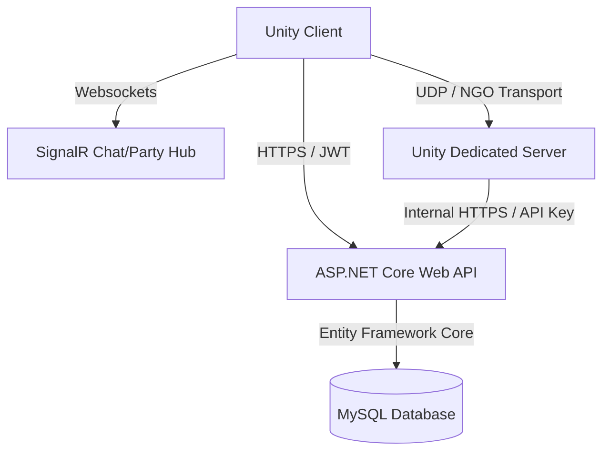

# 🎓 BỘ CÂU HỎI & TRẢ LỜI PHẢN BIỆN ĐỒ ÁN TỐT NGHIỆP
## Đề tài: Phát triển trò chơi Mutants Arena với hệ thống tiến hóa Gene bằng Unity
**Sinh viên thực hiện:** Trần Văn Thủy | **Mã SV:** CT060439 | **Lớp:** AT16D
**Giảng viên hướng dẫn:** TS. Nguyễn Đức Hiếu

---

> [!NOTE]
> Tài liệu này được biên soạn dựa trên slide báo cáo, mã nguồn và kiến trúc thực tế của dự án. Nội dung chia làm 6 nhóm chủ đề chính mà các thầy cô trong Hội đồng chấm đồ án thường xuyên đặt câu hỏi.

---

## MỤC LỤC
1. [Chủ đề 1: Tổng quan, Ý tưởng Đề tài & Thiết kế Game (Game Design)](#chủ-đề-1-tổng-quan-ý-tưởng-đề-tài--thiết-kế-game-game-design)
2. [Chủ đề 2: Kiến trúc Hệ thống & Giao thức Mạng (Tech Stack & Architecture)](#chủ-đề-2-kiến-trúc-hệ-thống--giao-thức-mạng-tech-stack--architecture)
3. [Chủ đề 3: Cơ chế Vật lý Platformer & Lập trình AI Quái vật (Gameplay & AI)](#chủ-đề-3-cơ-chế-vật-lý-platformer--lập-trình-ai-quái-vật-gameplay--ai)
4. [Chủ đề 4: Đồng bộ Mạng & Tối ưu hóa Hiệu năng (Realtime Sync & Optimization)](#chủ-đề-4-đồng-bộ-mạng--tối-ưu-hóa-hiệu-năng-realtime-sync--optimization)
5. [Chủ đề 5: Bảo mật Hệ thống & Chống Gian Lận (Security & Anti-Cheat)](#chủ-đề-5-bảo-mật-hệ-thống--chống-gian-lận-security--anti-cheat)
6. [Chủ đề 6: Thiết kế Cơ sở dữ liệu & Triển khai Hệ thống (Database & Devops)](#chủ-đề-6-thiết-kế-cơ-sở-dữ-liệu--triển-khai-hệ-thống-database--devops)

---

## CHỦ ĐỀ 1: TỔNG QUAN, Ý TƯỞNG ĐỀ TÀI & THIẾT KẾ GAME (GAME DESIGN)

### Câu 1: Tại sao em lại chọn thể loại game 2D Side-Scrolling Action RPG kết hợp hệ thống Tiến hóa Gene? Điểm mới/sáng tạo của đề tài này so với các game trên thị trường là gì?
* **Trả lời:**
  * **Về mặt kỹ thuật:** Thể loại 2D Side-Scrolling Platformer Action RPG đòi hỏi tốc độ phản hồi cực cao, kiểm soát va chạm vật lý chính xác và đồng bộ trạng thái realtime mượt mà. Đây là thử thách rất lớn khi làm game Multiplayer.
  * **Về tính sáng tạo (Hệ thống Gene):** Thay vì các lớp nhân vật (class) cố định truyền thống (như Đấu sĩ, Pháp sư), hệ thống Gene cho phép người chơi tùy biến hoàn toàn chỉ số và kỹ năng. 
    * Người chơi có thể khảm đồng thời **Gene chính** (nhận 100% chỉ số và kỹ năng) và **Gene phụ** (nhận 30% chỉ số).
    * Khi nâng cấp đạt Tier cao nhất, người chơi có thể **Dung hợp (Hybrid Fusion)** hai hệ nguyên tố khác nhau (ví dụ Kim + Phong) để tạo ra các lớp nhân vật lai với bộ kỹ năng độc nhất và hào quang (Aura) đặc trưng của **Gene Tối Thượng (Ultimate Gene)**. Điều này gia tăng chiều sâu chiến thuật và trải nghiệm cá nhân hóa.

### Câu 2: Em đã khảo sát các game tham chiếu nào (Hollow Knight, Dead Cells, Celeste, MapleStory, Làng Lá) và rút ra được bài học gì để áp dụng vào đồ án?
* **Trả lời:**
  * Em đã khảo sát 5 game tiêu biểu và rút ra các bài học thiết kế cốt lõi:
    1. **Celeste**: Bài học về di chuyển platformer mượt mà (áp dụng cơ chế dung sai vật lý *Coyote time* và *Jump buffer*).
    2. **Hollow Knight & Dead Cells**: Bài học về nhịp độ chiến đấu nhanh, cảm giác phản hồi đòn đánh (hitstop, screen shake) và thiết kế AI Boss đa giai đoạn linh hoạt.
    3. **MapleStory & Làng Lá**: Bài học về cấu trúc thế giới game cuộn màn hình ngang nhiều người chơi, tương tác NPC, tính năng cộng đồng (chat, tổ đội) và phân chia bản đồ (Zone/Room) để quản lý tải trọng của máy chủ.

### Câu 3: Ma trận tương khắc Ngũ Hành trong game hoạt động như thế nào? Sự xuất hiện của hệ thứ 6 (Phong) có vai trò gì trong việc cân bằng game?
* **Trả lời:**
  * Trò chơi xây dựng vòng tương khắc Ngũ Hành: **Kim ➔ Mộc ➔ Thủy ➔ Hỏa ➔ Thổ ➔ Kim**.
    * Khi hệ tấn công khắc hệ phòng thủ: Gây **x1.5** sát thương (Sát thương tăng thêm).
    * Khi hệ tấn công bị khắc bởi hệ phòng thủ: Gây **x0.75** sát thương (Sát thương giảm).
  * **Hệ thứ 6 (Phong - Wind)** đóng vai trò là hệ trung lập đặc biệt. Hệ Phong không khắc chế ai và cũng không bị ai khắc chế (hệ số sát thương luôn là **x1.0**). Sự xuất hiện của hệ Phong giúp người chơi có một lựa chọn build an toàn, cân bằng, không sợ bị khắc chế cứng bởi các đối thủ hệ khác trong đấu trường hoặc phó bản.

---

## CHỦ ĐỀ 2: KIẾN TRÚC HỆ THỐNG & GIAO THỨC MẠNG (TECH STACK & ARCHITECTURE)



### Câu 4: Hãy giải thích mô hình kiến trúc 3 tầng của hệ thống. Tại sao em lại tách thành: Unity Client, Dedicated Game Server và ASP.NET Core API Server?
* **Trả lời:**
  * Hệ thống được thiết kế theo mô hình lai (Hybrid Architecture) nhằm phân tách rõ ràng trách nhiệm (Separation of Concerns), tối ưu băng thông và bảo mật:
    1. **Unity Client**: Chịu trách nhiệm hiển thị giao diện, âm thanh, hiệu ứng hoạt ảnh, xử lý dữ liệu nhập từ người dùng (Input) và thực hiện dự đoán di chuyển để giảm độ trễ.
    2. **Dedicated Game Server (Unity Headless - NGO Host)**: Chỉ chạy logic tính toán vật lý, va chạm, AI quái vật, tiến trình phó bản thời gian thực. Server này chạy không có card đồ họa (headless) trên Linux VPS để tiết kiệm CPU/RAM và là nguồn dữ liệu tin cậy duy nhất (Server-Authoritative).
    3. **ASP.NET Core API Server**: Đảm nhận các tác vụ không yêu cầu realtime quá cao như: Xác thực tài khoản, lưu trữ cơ sở dữ liệu nhân vật, xử lý giao dịch mua bán, nâng cấp trang bị, quản lý tổ đội và chat qua SignalR.
  * **Lý do phân tách:** Nếu gộp tất cả vào Game Server, server sẽ bị quá tải CPU do phải xử lý kết nối DB và các tác vụ nghiệp vụ. Việc tách biệt giúp bảo mật database (nằm sau tường lửa, Game Server chỉ tương tác qua API nội bộ với API Key) và dễ dàng mở rộng (Scale) độc lập các thành phần.

### Câu 5: Tại sao em lại sử dụng đồng thời cả 3 giao thức/kết nối mạng: HTTP REST API, SignalR (WebSockets) và Unity Netcode for GameObjects (UDP)? Tại sao không dùng duy nhất một loại?
* **Trả lời:**
  * Mỗi giao thức được thiết kế tối ưu cho một mục đích truyền tải dữ liệu cụ thể:
    * **HTTP REST API (TCP)**: Thích hợp cho các tác vụ dạng Request-Response yêu cầu độ tin cậy tuyệt đối và không cần realtime liên tục, chẳng hạn như đăng nhập, tải dữ liệu nhân vật, mua bán vật phẩm.
    * **SignalR WebSockets (TCP)**: Thích hợp cho giao tiếp hai chiều realtime dạng tin nhắn văn bản hoặc cập nhật trạng thái nhẹ như hệ thống chat thế giới/tổ đội, danh sách bạn bè online/offline. Dùng Websocket ở đây giúp giảm tải cho Game Server chính.
    * **Netcode for GameObjects (UDP - Unity Transport)**: Thích hợp cho việc đồng bộ hóa vị trí, trạng thái chiến đấu, đòn đánh và va chạm vật lý thời gian thực. UDP không yêu cầu bắt tay ba bước phức tạp hay truyền lại gói tin bị mất như TCP, giúp giảm thiểu tối đa độ trễ truyền gói tin di chuyển.

### Câu 6: Hãy giải thích luồng kết nối từ lúc người chơi mở game, đăng nhập đến lúc hiển thị nhân vật trong map thế giới.
* **Trả lời:**
  1. **Đăng nhập:** Client gửi thông tin tài khoản/mật khẩu qua HTTPS đến REST API `/api/auth/login`. API kiểm tra và trả về token JWT.
  2. **Kết nối Game Server:** Client gửi yêu cầu kết nối UDP đến Dedicated Game Server kèm theo token JWT này trong payload bắt tay (Connection Approval payload).
  3. **Xác thực kết nối:** Dedicated Game Server dùng `JwtValidator` để giải mã JWT, xác thực danh tính người chơi. Nếu hợp lệ, chấp nhận kết nối và tìm vị trí lưu gần nhất (`map_id`, `zone_id`) của người chơi đó từ cơ sở dữ liệu (thông qua API `/api/player/{userId}/data`).
  4. **Spawn nhân vật:** Server đọc thông tin giới tính, hệ phái (element) của nhân vật để sinh (Spawn) đúng Prefab tương ứng và gán quyền điều khiển (Ownership) cho Client. Đồng thời, máy chủ đặt người chơi vào đúng Zone/Room thông qua `ZoneRoomRegistry`.

---

## CHỦ ĐỀ 3: CƠ CHẾ VẬT LÝ PLATFORMER & LẬP TRÌNH AI QUÁI VẬT (GAMEPLAY & AI)

### Câu 7: Coyote Time và Jump Buffer là gì? Em đã lập trình hai cơ chế này như thế nào trong Unity?
* **Trả lời:**
  * Đây là hai cơ chế "Dung sai vật lý" giúp cải thiện đáng kể trải nghiệm điều khiển trong game Platformer (nhảy nền tảng):
    * **Coyote Time (Thời gian sói chạy trên không)**: Cho phép nhân vật vẫn có thể nhảy dù đã đi lệch khỏi mép nền đất trong một khoảng thời gian cực ngắn (khoảng 0.1 - 0.15s). 
      * *Cách code:* Sử dụng một biến đếm thời gian rơi tự do (`coyoteTimeCounter`). Khi nhân vật còn ở trên mặt đất (`isGrounded = true`), reset biến này về giá trị tối đa (ví dụ `0.1s`). Khi rời đất, biến này bắt đầu giảm dần theo `Time.deltaTime`. Người chơi chỉ được phép nhảy khi `coyoteTimeCounter > 0`.
    * **Jump Buffer (Bộ đệm nhảy)**: Cho phép lưu lệnh nhảy khi người chơi nhấn nút nhảy trước khi nhân vật chạm đất một chút (khoảng 0.1 - 0.15s), lệnh nhảy sẽ tự kích hoạt ngay khi chân chạm đất.
      * *Cách code:* Khi người chơi nhấn nút Nhảy, gán biến `jumpBufferCounter` bằng `0.15s`. Biến này giảm dần theo thời gian. Khi nhân vật chạm đất và `jumpBufferCounter > 0`, thực hiện lực nhảy hướng lên và reset `jumpBufferCounter = 0`.

### Câu 8: Tại sao em lại chọn mô hình FSM (Finite State Machine) để lập trình trí tuệ nhân tạo (AI) cho quái vật và Boss? FSM này gồm những trạng thái nào?
* **Trả lời:**
  * **Lý do chọn FSM:** FSM (Máy trạng thái hữu hạn) là mô hình thiết kế AI kinh điển, dễ triển khai, dễ kiểm soát lỗi và tiêu tốn cực kỳ ít tài nguyên CPU. Điều này rất quan trọng khi Dedicated Server phải chạy đồng thời hàng trăm quái vật mà không có card đồ họa hỗ trợ.
  * **Các trạng thái của AI quái vật:**
    * `Idle` (Đứng im): Quái vật đứng yên canh gác tại chỗ.
    * `Patrol` (Tuần tra): Quái vật di chuyển qua lại giữa các điểm tuần tra cố định.
    * `Chase` (Đuổi theo): Khi người chơi đi vào vùng phát hiện (detection range), quái vật chuyển sang trạng thái đuổi theo người chơi gần nhất.
    * `Attack` (Tấn công): Khi khoảng cách tới người chơi nhỏ hơn tầm đánh (attack range) và hồi chiêu kết thúc, quái vật thực hiện đòn đánh.
    * `Hit/Dead` (Trúng đòn / Chết): Khi trúng đòn, quái vật bị khựng (hitstun) và khi HP về 0, chuyển sang trạng thái Dead để hủy Object (Despawn) và trả tài nguyên về cho server.

### Câu 9: Cơ chế Boss đa giai đoạn (Multi-phase Boss AI) được thiết kế và vận hành như thế nào? Dữ liệu các pha được lưu trữ ở đâu?
* **Trả lời:**
  * **Thiết kế:** Boss có nhiều giai đoạn hành vi dựa trên lượng máu (HP) còn lại để tăng độ khó kịch tính. 
    * Ví dụ: Giai đoạn 1 (HP > 60%), Giai đoạn 2 (60% >= HP > 30% - Boss nổi giận, tăng tốc độ chạy và sát thương), Giai đoạn 3 (HP <= 30% - Boss trạng thái Berserk, kích hoạt kỹ năng đặc biệt, triệu hồi quái đệ).
  * **Vận hành:** Lớp `BossAI` chạy trên Server liên tục theo dõi sự thay đổi thuộc tính HP. Khi phát hiện HP giảm qua ngưỡng quy định, hàm `ExecutePhase()` được gọi. Server phát một ClientRpc thông báo cho tất cả client thay đổi nhạc nền, hiệu ứng Aura của Boss và đổi bộ Animator hoạt ảnh.
  * **Lưu trữ dữ liệu:** Cấu hình các pha của Boss (ngưỡng HP, chỉ số tăng thêm, danh sách quái triệu hồi) được lưu dưới dạng chuỗi JSON trong cột `phases_json` của bảng Boss trong database MySQL, giúp thiết kế linh hoạt mà không cần thay đổi cấu trúc bảng cơ sở dữ liệu.

---

## CHỦ ĐỀ 4: ĐỒNG BỘ MẠNG & TỐI ƯU HÓA HIỆU NĂNG (REALTIME SYNC & OPTIMIZATION)

### Câu 10: Hãy giải thích cách hoạt động của cơ chế Client-side Prediction (Dự đoán phía Client) và Server Reconciliation (Đồng bộ lại từ Server) áp dụng trong game của em.
* **Trả lời:**
  * Đây là kỹ thuật cốt lõi giúp loại bỏ cảm giác trễ (lag) khi di chuyển trong môi trường mạng có độ trễ (ping) cao:
    * **Client-side Prediction (Dự đoán):** Khi người chơi nhấn nút di chuyển (ví dụ: sang phải), Client không đợi máy chủ phản hồi mà lập tức di chuyển nhân vật cục bộ trên màn hình và lưu thông tin lệnh di chuyển đó (kèm số thứ tự Frame/Tick) vào một hàng đợi (Queue). Người chơi sẽ thấy game mượt mà ngay lập tức.
    * **Server Reconciliation (Đối chiếu & Sửa sai):** Client đồng thời gửi lệnh di chuyển lên Server. Server nhận được, xử lý vật lý và gửi lại vị trí chuẩn (State) kèm theo số Tick tương ứng về Client.
    * **Xử lý sai lệch:** Client nhận vị trí chuẩn từ Server, so sánh với vị trí dự đoán tại Tick đó. Nếu sai lệch nhỏ hơn một ngưỡng cho phép (threshold), client chấp nhận. Nếu sai lệch vượt ngưỡng (do va chạm vật lý với quái vật hoặc người chơi khác trên server mà client chưa biết), client sẽ ghi đè vị trí của mình bằng vị trí chuẩn của Server, sau đó chạy lại (Replay) các lệnh di chuyển còn lại trong hàng đợi để đưa nhân vật về vị trí mới nhất. Quá trình này được nội suy (Interpolation) mượt mà để tránh hiện tượng giật lùi đột ngột (rubber banding).

### Câu 11: Zone-based Server là gì? Em đã làm thế nào để quản lý các Zone công cộng (Public Zone) và các Zone phó bản riêng tư (Instance Zone)?
* **Trả lời:**
  * **Khái niệm:** Hệ thống phân chia bản đồ thành nhiều vùng không gian ảo độc lập gọi là Zone (Khu vực) thông qua `ZoneRoomRegistry`. Người chơi ở các Zone khác nhau sẽ không nhìn thấy nhau và không nhận gói tin của nhau.
  * **Quản lý Zone:**
    * **SharedPublic (Map thường - Sảnh/Làng):** Server tự động khởi tạo số lượng Zone cố định (ví dụ 15 zone). Người chơi có thể tự do đổi khu vực thông qua bảng chọn kênh (RPC request gửi lên server).
    * **InstanceOnly (Map phó bản/Dungeon):** Khi một tổ đội hoặc người chơi cá nhân đăng ký đi ải, `ZoneTransitionController` trên Server sẽ tạo động một Zone mới với mã định danh âm (`zone_id < 0`). Zone này hoàn toàn cô lập, chỉ cho phép các thành viên trong tổ đội đó kết nối vào và sẽ tự động bị tiêu hủy, giải phóng tài nguyên RAM ngay khi phó bản hoàn thành hoặc người chơi rời đi.

### Câu 12: Làm thế nào để tối ưu hóa băng thông mạng khi có quá nhiều người chơi cùng kết nối vào một Game Server?
* **Trả lời:**
  * Em áp dụng cơ chế lọc tầm nhìn / khu vực: **NetworkVisibilityZoneFilter**.
  * Thay vì đồng bộ vị trí, hoạt ảnh của tất cả người chơi cho toàn bộ máy chủ (gây quá tải đường truyền O(N^2)), Server chỉ gửi gói tin cập nhật trạng thái của các thực thể (người chơi khác, quái vật, vật phẩm) cho những client đang ở **cùng một zone** và trong khoảng cách tầm nhìn của nhau.
  * Ngoài ra, các thuộc tính không thay đổi liên tục như tên nhân vật, cấp độ, trang bị được đồng bộ một lần duy nhất lúc spawn hoặc qua các gói tin RPC sự kiện, thay vì gửi liên tục trong vòng lặp cập nhật vị trí.

---

## CHỦ ĐỀ 5: BẢO MẬT HỆ THỐNG & CHỐNG GIAN LẬN (SECURITY & ANTI-CHEAT)

### Câu 13: Em làm thế nào để ngăn chặn người chơi sử dụng các công cụ can thiệp bộ nhớ (ví dụ: Cheat Engine) để thay đổi lượng máu (HP) hoặc số vàng kiếm được trong game?
* **Trả lời:**
  * Nhờ áp dụng kiến trúc **Server-Authoritative (Máy chủ làm chủ)**:
    * Client hoàn toàn không có quyền quyết định lượng HP, sát thương gây ra hay số vàng nhận được. Client chỉ gửi Input (lệnh nhấn nút tấn công, di chuyển) lên máy chủ thông qua RPC.
    * Mọi tính toán va chạm (Hitbox vs Hurtbox), lượng sát thương thực tế dựa trên thuộc tính nhân vật, và phần thưởng rơi ra từ quái vật đều do **Dedicated Server thực hiện tính toán trên RAM của máy chủ**.
    * Nếu người chơi dùng Cheat Engine đổi HP ở Client thành 9999, đó chỉ là giá trị hiển thị ảo trên giao diện Client. Khi quái vật đánh trúng, Server vẫn trừ máu dựa trên chỉ số HP thực lưu trên server. Nếu Client gửi yêu cầu mua đồ bằng số tiền ảo đã hack, Server sẽ kiểm tra số dư thực tế trong cache/DB và từ chối giao dịch.

### Câu 14: Hãy giải thích cơ chế bảo mật kết nối Connection Approval và Zone API Key trong hệ thống của em.
* **Trả lời:**
  * Hệ thống triển khai bảo mật nhiều lớp:
    1. **Connection Approval (Duyệt kết nối mạng):** Khi client cố gắng kết nối vào cổng UDP 7777 của Dedicated Game Server, kết nối không được thiết lập ngay. Hàm phê duyệt kết nối `ApprovalCheck` được gọi. Server giải mã chuỗi Token JWT do Client gửi kèm trong payload. Chỉ khi token hợp lệ (đúng chữ ký số và chưa hết hạn), Client mới được phép kết nối và sinh nhân vật.
    2. **Zone API Key (Xác thực nội bộ):** Khi Dedicated Server cần lưu tiến trình của người chơi (vị trí, kinh nghiệm, túi đồ) vào cơ sở dữ liệu, nó không trực tiếp ghi vào DB MySQL mà gọi các API REST HTTP đến API Server. Để tránh việc kẻ xấu giả mạo Dedicated Server gửi yêu cầu API ghi khống dữ liệu, mọi yêu cầu từ Dedicated Server gửi lên API Server đều phải đính kèm một mã khóa bí mật **API Key** trong Header. API Server chỉ chấp nhận ghi nhận dữ liệu nếu API Key trùng khớp với cấu hình hệ thống.

---

## CHỦ ĐỀ 6: THIẾT KẾ CƠ SỞ DỮ LIỆU & TRIỂN KHAI HỆ THỐNG (DATABASE & DEVOPS)

### Sơ đồ Cơ sở dữ liệu vật lý (Phần thực thể chính)
```
  ┌──────────────┐          ┌─────────────┐          ┌─────────────┐
  │    Users     │ 1      1 │ Player_Data │ 1      1 │  Gene_Data  │
  │  (Account)   ├──────────┤ (Character) ├──────────┤   (Genes)   │
  └──────────────┘          └──────┬──────┘          └─────────────┘
                                   │ 1
                                   │
                                   │ 1..* (Cột JSON)
                            ┌──────┴──────┐
                            │  Inventory  │
                            │  (Items)    │
                            └─────────────┘
```

### Câu 15: Tại sao em lại chọn hệ quản trị cơ sở dữ liệu MySQL? Thiết kế sử dụng cột JSON (JSON Column) trong bảng dữ liệu nhân vật mang lại lợi ích và hạn chế gì?
* **Trả lời:**
  * **Lý do chọn MySQL:** MySQL là hệ quản trị CSDL quan hệ (RDBMS) mã nguồn mở phổ biến, có tính ổn định cao, hỗ trợ tốt các giao dịch ACID đảm bảo tính toàn vẹn dữ liệu tài khoản và nhân vật, đồng thời hỗ trợ kiểu dữ liệu JSON rất mạnh mẽ từ phiên bản 5.7+.
  * **Lợi ích của cột JSON:**
    * *Linh hoạt hóa cấu trúc:* Cho phép lưu trữ các dữ liệu có tính biến động cao hoặc cấu trúc phức tạp như danh sách thuộc tính ẩn của trang bị (dòng op ngẫu nhiên), tiến trình nhiệm vụ đang thực hiện, danh sách ô phím tắt kỹ năng.
    * *Tối ưu hóa hiệu năng:* Giảm số lượng bảng liên kết (1-nhiều) và giảm thiểu các câu truy vấn phức tạp dùng phép `JOIN`. Việc lưu toàn bộ túi đồ (Inventory) thành một chuỗi JSON trong một dòng của bảng nhân vật giúp tốc độ đọc/ghi dữ liệu khi người chơi đăng nhập/đăng xuất tăng đến 40%.
  * **Hạn chế:**
    * Không thể tạo khóa ngoại (Foreign Key) ràng buộc chặt chẽ bên trong cấu trúc JSON.
    * Việc truy vấn lọc dữ liệu phức tạp theo các trường bên trong JSON sẽ chậm hơn so với các cột thông thường nếu không đánh chỉ mục (Index) chuyên biệt (Virtual Columns). Tuy nhiên, với game RPG, dữ liệu nhân vật thường được tải nguyên khối lên RAM khi đăng nhập nên hạn chế này không ảnh hưởng nhiều.

### Câu 16: Hãy giải thích quy trình triển khai hệ thống thông qua Docker Compose trên VPS Linux. Mạng nội bộ Docker bridge giúp ích gì cho bảo mật?
* **Trả lời:**
  * **Quy trình triển khai:** Em đóng gói toàn bộ các thành phần hệ thống thành 3 Container Docker độc lập và quản lý thông qua file `docker-compose.yml`:
    1. Container `db-mysql`: Chạy cơ sở dữ liệu MySQL 8.0 với ổ đĩa ngoài (Docker Volume) để lưu trữ dữ liệu bền vững.
    2. Container `web-api`: Chạy ASP.NET Core API Server, lắng nghe cổng HTTP 80/443 phục vụ REST API công khai.
    3. Container `game-server`: Chạy Unity Dedicated Server headless, mở cổng UDP 7777 để phục vụ đồng bộ game thời gian thực.
  * **Lợi ích bảo mật của mạng Docker bridge:**
    * Khi khởi chạy Docker Compose, một mạng ảo nội bộ dạng bridge tự động được tạo ra.
    * Container `db-mysql` chỉ kết nối vào mạng nội bộ này và **không mở bất kỳ cổng nào ra môi trường Internet bên ngoài** (không expose port 3306).
    * API Server (`web-api`) and Database (`db-mysql`) giao tiếp với nhau an toàn trong mạng nội bộ Docker này. Kẻ tấn công từ bên ngoài hoàn toàn không thể quét cổng hoặc tấn công trực tiếp vào cơ sở dữ liệu MySQL.

---

## 💡 KINH NGHIỆM PHÒNG THỦ & TRẢ LỜI TRƯỚC HỘI ĐỒNG
1. **Thành thật & Khiêm tốn:** Nếu thầy cô hỏi một vấn đề quá khó hoặc nằm ngoài phạm vi đề tài (ví dụ: cách chống DDoS mạng UDP cấp độ hạ tầng, hoặc tối ưu cơ sở dữ liệu sharding triệu người chơi):
   * *Nên trả lời:* *"Dạ thưa thầy/cô, đây là một vấn đề rất hay và thực tế ạ. Tuy nhiên do giới hạn thời gian thực hiện đồ án tốt nghiệp và quy mô nguyên mẫu (prototype) hiện tại, em chưa kịp triển khai giải pháp đó. Em đã ghi nhận và xin phép được bổ sung nghiên cứu phương án này trong phần Định hướng phát triển tương lai ở trang cuối của báo cáo ạ."*
2. **Làm nổi bật thế mạnh:** Tránh để thầy cô nghĩ game này chỉ chạy local. Luôn nhấn mạnh cụm từ **"Dedicated Server (Server-Authoritative)"** và **"Bảo mật nhiều lớp từ kết nối UDP đến REST API"** vì đây là các yếu tố kỹ thuật khó và được đánh giá rất cao trong đồ án Công nghệ thông tin/An toàn thông tin.
3. **Giải thích rõ hạn chế:** Khi thầy cô nhận xét đồ họa hoặc số lượng quái còn đơn điệu, hãy giải thích trọng tâm đồ án tập trung vào việc **xây dựng kiến trúc hệ thống mạng, đồng bộ di chuyển triệt tiêu độ trễ và cơ chế tiến hóa gene linh hoạt**.
